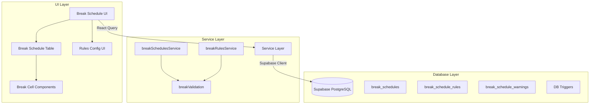

# Design Document: Break Schedule Management

## Overview

The Break Schedule Management feature provides a comprehensive system for planning and managing agent break times across 15-minute intervals throughout the workday. The system implements role-based access control with read-only views for Agents and Team Leads, while WFM administrators have full planning capabilities with configurable business rules to maintain optimal staffing levels.

### Key Design Principles

- **Role-Based Access**: Agents view their own schedules, Team Leads view their team, WFM administrators have full planning control
- **Real-Time Validation**: Break schedules are validated against configurable business rules with immediate feedback
- **Automatic Integration**: Seamless integration with shift changes and swap requests to maintain data consistency
- **Optimized Performance**: Efficient data structures and queries to handle large teams (100+ agents) with minimal latency
- **Extensibility**: Configurable rule engine allows business logic changes without code modifications

### Technology Stack

- **Frontend**: React with TypeScript, React Query for state management
- **Backend**: Supabase (PostgreSQL) with Row Level Security policies
- **Validation**: Client-side and server-side validation using Zod schemas
- **UI Components**: Tailwind CSS with existing design system patterns

## Architecture

### System Components



### Data Flow

1. **Read Flow (Agent/TL)**:
   - User navigates to break schedule page
   - React Query fetches data via breakSchedulesService
   - RLS policies filter data based on user role
   - UI renders read-only table with break schedules

2. **Plan Flow (WFM)**:
   - WFM clicks on interval cells to modify breaks
   - Changes are debounced (500ms) before saving
   - Client-side validation runs against active rules
   - If valid, changes are saved to database
   - If invalid, inline errors are displayed
   - React Query cache is updated optimistically

3. **Shift Change Flow**:
   - Shift type is updated in shifts table
   - Database trigger detects change
   - Trigger clears all breaks for that user/date
   - Trigger creates warning record
   - UI displays warning indicator on next load

4. **Swap Approval Flow**:
   - Swap request status changes to 'approved'
   - Database trigger detects approval
   - Trigger swaps break schedules between users
   - Both users' schedules are updated atomically

### Component Hierarchy

```
BreakSchedule (Page)
├── DateNavigation
│   ├── PrevDayButton
│   ├── DateDisplay
│   ├── NextDayButton
│   └── TodayButton
├── FilterBar
│   ├── SearchInput
│   ├── DepartmentFilter
│   └── ActionButtons (WFM only)
│       ├── AutoDistributeButton
│       ├── ImportButton
│       └── ExportButton
└── BreakScheduleTable
    ├── TableHeader
    │   ├── StickyAgentColumn
    │   ├── ShiftColumn
    │   ├── BreakTimeColumns (HB1, B, HB2)
    │   └── IntervalColumns (9:00-21:00)
    ├── TotalInRow (Summary)
    │   └── CoverageCell (with color scale)
    └── AgentRows
        ├── AgentNameCell (with warning icon)
        ├── ShiftTypeCell
        ├── BreakTimeCell
        └── IntervalCells
            └── BreakCell (clickable for WFM)
```

## Components and Interfaces

### Database Schema

#### 1. break_schedules Table

Stores individual break schedule entries for each 15-minute interval.

```sql
CREATE TABLE break_schedules (
  id UUID PRIMARY KEY DEFAULT uuid_generate_v4(),
  user_id UUID NOT NULL REFERENCES auth.users(id) ON DELETE CASCADE,
  schedule_date DATE NOT NULL,
  shift_type TEXT, -- Denormalized for quick access
  interval_start TIME NOT NULL, -- e.g., '09:00:00'
  break_type TEXT NOT NULL CHECK (break_type IN ('IN', 'HB1', 'B', 'HB2')),
  created_by UUID REFERENCES auth.users(id),
  created_at TIMESTAMPTZ DEFAULT NOW(),
  updated_at TIMESTAMPTZ DEFAULT NOW(),
  
  UNIQUE(user_id, schedule_date, interval_start)
);

CREATE INDEX idx_break_schedules_date ON break_schedules(schedule_date);
CREATE INDEX idx_break_schedules_user_date ON break_schedules(user_id, schedule_date);
CREATE INDEX idx_break_schedules_date_interval ON break_schedules(schedule_date, interval_start);
```

**Design Rationale**:
- `shift_type` is denormalized to avoid joins when querying schedules
- Unique constraint prevents duplicate intervals per user per day
- Indexes optimize common query patterns (by date, by user+date)
- `created_by` tracks who scheduled the break for audit purposes


#### 2. break_schedule_rules Table

Stores configurable business rules for break scheduling validation.

```sql
CREATE TABLE break_schedule_rules (
  id UUID PRIMARY KEY DEFAULT uuid_generate_v4(),
  rule_name TEXT NOT NULL UNIQUE,
  rule_type TEXT NOT NULL CHECK (rule_type IN ('distribution', 'ordering', 'timing', 'coverage')),
  description TEXT,
  parameters JSONB NOT NULL,
  is_active BOOLEAN DEFAULT true,
  is_blocking BOOLEAN DEFAULT false, -- If true, prevents saving; if false, shows warning
  priority INTEGER DEFAULT 0, -- Lower number = higher priority
  created_at TIMESTAMPTZ DEFAULT NOW(),
  updated_at TIMESTAMPTZ DEFAULT NOW()
);
```

**Example Rules**:

```sql
INSERT INTO break_schedule_rules (rule_name, rule_type, description, parameters, is_blocking, priority) VALUES
('break_ordering', 'ordering', 'HB1 must come before B, B before HB2',
  '{"sequence": ["HB1", "B", "HB2"], "enforce_strict": true}', true, 1),
  
('minimum_gap', 'timing', 'Minimum time between consecutive breaks',
  '{"min_minutes": 90, "applies_to": ["HB1-B", "B-HB2"]}', true, 2),
  
('maximum_gap', 'timing', 'Maximum time between consecutive breaks',
  '{"max_minutes": 270, "applies_to": ["HB1-B", "B-HB2"]}', false, 3),

('shift_boundary', 'timing', 'Breaks must be within shift hours',
  '{"enforce_strict": true}', true, 4),

('minimum_coverage', 'coverage', 'Minimum agents required per interval',
  '{"min_agents": 3, "alert_threshold": 5}', false, 5);
```

**Design Rationale**:
- JSONB parameters allow flexible rule configuration without schema changes
- `is_blocking` determines if rule violations prevent saving or just warn
- `priority` resolves conflicts when multiple rules apply
- `rule_type` categorizes rules for organized display in UI

#### 3. break_schedule_warnings Table

Tracks warnings when shifts change and breaks are cleared.

```sql
CREATE TABLE break_schedule_warnings (
  id UUID PRIMARY KEY DEFAULT uuid_generate_v4(),
  user_id UUID NOT NULL REFERENCES auth.users(id) ON DELETE CASCADE,
  schedule_date DATE NOT NULL,
  warning_type TEXT NOT NULL CHECK (warning_type IN ('shift_changed', 'breaks_cleared', 'swap_pending')),
  old_shift_type TEXT,
  new_shift_type TEXT,
  is_resolved BOOLEAN DEFAULT false,
  created_at TIMESTAMPTZ DEFAULT NOW(),
  
  UNIQUE(user_id, schedule_date, warning_type)
);

CREATE INDEX idx_warnings_unresolved ON break_schedule_warnings(schedule_date, is_resolved);
```

**Design Rationale**:
- Unique constraint ensures one warning per user/date/type
- `is_resolved` allows WFM to dismiss warnings after review
- Index on unresolved warnings optimizes common queries

#### 4. Database Triggers

**Shift Change Trigger**: Automatically clears breaks when shift type changes.

```sql
CREATE OR REPLACE FUNCTION handle_shift_change()
RETURNS TRIGGER AS $$
BEGIN
  IF OLD.shift_type IS DISTINCT FROM NEW.shift_type THEN
    DELETE FROM break_schedules
    WHERE user_id = NEW.user_id
      AND schedule_date = NEW.date;
    
    INSERT INTO break_schedule_warnings (user_id, schedule_date, warning_type, old_shift_type, new_shift_type)
    VALUES (NEW.user_id, NEW.date, 'shift_changed', OLD.shift_type, NEW.shift_type)
    ON CONFLICT (user_id, schedule_date, warning_type)
    DO UPDATE SET
      old_shift_type = EXCLUDED.old_shift_type,
      new_shift_type = EXCLUDED.new_shift_type,
      is_resolved = false,
      created_at = NOW();
  END IF;
  
  RETURN NEW;
END;
$$ LANGUAGE plpgsql;

CREATE TRIGGER shift_change_trigger
  AFTER UPDATE ON shifts
  FOR EACH ROW
  EXECUTE FUNCTION handle_shift_change();
```

**Swap Breaks Trigger**: Automatically swaps breaks when swap request is approved.

```sql
CREATE OR REPLACE FUNCTION swap_break_schedules()
RETURNS TRIGGER AS $$
BEGIN
  IF NEW.status = 'approved' AND OLD.status != 'approved' THEN
    -- Swap breaks for date1
    WITH temp_breaks AS (
      DELETE FROM break_schedules
      WHERE (user_id = NEW.requester_id OR user_id = NEW.target_user_id)
        AND schedule_date = NEW.date1
      RETURNING *
    )
    INSERT INTO break_schedules (user_id, schedule_date, shift_type, interval_start, break_type, created_by)
    SELECT
      CASE
        WHEN user_id = NEW.requester_id THEN NEW.target_user_id
        ELSE NEW.requester_id
      END,
      schedule_date,
      shift_type,
      interval_start,
      break_type,
      NEW.updated_by
    FROM temp_breaks;
    
    -- Swap breaks for date2
    WITH temp_breaks AS (
      DELETE FROM break_schedules
      WHERE (user_id = NEW.requester_id OR user_id = NEW.target_user_id)
        AND schedule_date = NEW.date2
      RETURNING *
    )
    INSERT INTO break_schedules (user_id, schedule_date, shift_type, interval_start, break_type, created_by)
    SELECT
      CASE
        WHEN user_id = NEW.requester_id THEN NEW.target_user_id
        ELSE NEW.requester_id
      END,
      schedule_date,
      shift_type,
      interval_start,
      break_type,
      NEW.updated_by
    FROM temp_breaks;
  END IF;
  
  RETURN NEW;
END;
$$ LANGUAGE plpgsql;

CREATE TRIGGER swap_breaks_trigger
  AFTER UPDATE ON swap_requests
  FOR EACH ROW
  EXECUTE FUNCTION swap_break_schedules();
```

**Design Rationale**:
- Triggers ensure data consistency automatically
- Atomic operations prevent partial updates
- `created_by` is set to the approver for audit trail


### Row Level Security Policies

```sql
ALTER TABLE break_schedules ENABLE ROW LEVEL SECURITY;

-- Agents can view their own breaks
CREATE POLICY "Agents can view own breaks"
  ON break_schedules FOR SELECT
  USING (auth.uid() = user_id);

-- TL can view their team's breaks
CREATE POLICY "TL can view team breaks"
  ON break_schedules FOR SELECT
  USING (
    EXISTS (
      SELECT 1 FROM employees
      WHERE employees.id = auth.uid()
      AND employees.role = 'tl'
      AND employees.department = (
        SELECT department FROM employees WHERE id = break_schedules.user_id
      )
    )
  );

-- WFM can view all breaks
CREATE POLICY "WFM can view all breaks"
  ON break_schedules FOR SELECT
  USING (
    EXISTS (
      SELECT 1 FROM employees
      WHERE id = auth.uid() AND role = 'wfm'
    )
  );

-- Only WFM can insert/update/delete
CREATE POLICY "WFM can manage breaks"
  ON break_schedules FOR ALL
  USING (
    EXISTS (
      SELECT 1 FROM employees
      WHERE id = auth.uid() AND role = 'wfm'
    )
  );

-- Rules table policies
ALTER TABLE break_schedule_rules ENABLE ROW LEVEL SECURITY;

CREATE POLICY "Everyone can view rules"
  ON break_schedule_rules FOR SELECT
  USING (true);

CREATE POLICY "WFM can manage rules"
  ON break_schedule_rules FOR ALL
  USING (
    EXISTS (
      SELECT 1 FROM employees
      WHERE id = auth.uid() AND role = 'wfm'
    )
  );
```

### TypeScript Interfaces

```typescript
// Break Schedule Types
export type BreakType = 'IN' | 'HB1' | 'B' | 'HB2'

export interface BreakSchedule {
  id: string
  user_id: string
  schedule_date: string // ISO date string
  shift_type: ShiftType | null
  interval_start: string // Time string 'HH:MM:SS'
  break_type: BreakType
  created_by: string | null
  created_at: string
  updated_at: string
}

export interface BreakScheduleRule {
  id: string
  rule_name: string
  rule_type: 'distribution' | 'ordering' | 'timing' | 'coverage'
  description: string | null
  parameters: Record<string, any>
  is_active: boolean
  is_blocking: boolean
  priority: number
  created_at: string
  updated_at: string
}

export interface BreakScheduleWarning {
  id: string
  user_id: string
  schedule_date: string
  warning_type: 'shift_changed' | 'breaks_cleared' | 'swap_pending'
  old_shift_type: ShiftType | null
  new_shift_type: ShiftType | null
  is_resolved: boolean
  created_at: string
}

// API Response Types
export interface AgentBreakSchedule {
  user_id: string
  name: string
  shift_type: ShiftType | null
  department: string
  has_warning: boolean
  warning_details: BreakScheduleWarning | null
  breaks: {
    HB1: string | null // Start time 'HH:MM:SS'
    B: string | null
    HB2: string | null
  }
  intervals: Record<string, BreakType> // Key: 'HH:MM', Value: BreakType
}

export interface BreakScheduleSummary {
  [interval: string]: {
    in: number
    hb1: number
    b: number
    hb2: number
  }
}

export interface BreakScheduleResponse {
  agents: AgentBreakSchedule[]
  summary: BreakScheduleSummary
}

export interface ValidationViolation {
  rule_name: string
  message: string
  severity: 'error' | 'warning'
  affected_intervals?: string[]
}

export interface BreakScheduleUpdateRequest {
  user_id: string
  schedule_date: string
  intervals: Array<{
    interval_start: string
    break_type: BreakType
  }>
}

export interface BreakScheduleUpdateResponse {
  success: boolean
  violations: ValidationViolation[]
}

// CSV Import/Export Types
export interface BreakScheduleCSVRow {
  agent_name: string
  date: string
  shift: ShiftType
  hb1_start: string | null
  b_start: string | null
  hb2_start: string | null
}

export interface ImportResult {
  success: boolean
  imported: number
  errors: Array<{
    row: number
    agent: string
    error: string
  }>
}

// Auto-Distribution Types
export type DistributionStrategy = 'balanced_coverage' | 'staggered_timing'
export type ApplyMode = 'only_unscheduled' | 'all_agents'

export interface AutoDistributeRequest {
  schedule_date: string
  strategy: DistributionStrategy
  apply_mode: ApplyMode
  department?: string
}

export interface AutoDistributePreview {
  proposed_schedules: AgentBreakSchedule[]
  coverage_stats: {
    min_coverage: number
    max_coverage: number
    avg_coverage: number
    variance: number
  }
  rule_compliance: {
    total_violations: number
    blocking_violations: number
    warning_violations: number
  }
  failed_agents: Array<{
    user_id: string
    name: string
    reason: string
  }>
}
```

### Service Layer Interfaces

```typescript
// breakSchedulesService.ts
export interface BreakSchedulesService {
  getScheduleForDate(date: string, department?: string): Promise<BreakScheduleResponse>
  updateSchedule(request: BreakScheduleUpdateRequest): Promise<BreakScheduleUpdateResponse>
  validateSchedule(request: BreakScheduleUpdateRequest): Promise<ValidationViolation[]>
  exportCSV(date: string, department?: string): Promise<Blob>
  importCSV(file: File): Promise<ImportResult>
  dismissWarning(warningId: string): Promise<void>
  autoDistribute(request: AutoDistributeRequest): Promise<AutoDistributePreview>
  applyAutoDistribution(preview: AutoDistributePreview): Promise<BreakScheduleUpdateResponse>
}

// breakRulesService.ts
export interface BreakRulesService {
  getRules(): Promise<BreakScheduleRule[]>
  updateRule(ruleId: string, updates: Partial<BreakScheduleRule>): Promise<BreakScheduleRule>
  toggleRule(ruleId: string, isActive: boolean): Promise<BreakScheduleRule>
}
```


## Data Models

### Break Schedule Data Model

The break schedule data model represents the state of agent breaks across 15-minute intervals.

**Core Entities**:

1. **BreakSchedule**: Individual interval entry
   - Represents one 15-minute slot for one agent
   - Immutable once created (updates create new records)
   - Linked to user and shift information

2. **BreakScheduleRule**: Configurable validation rule
   - Defines business logic for break scheduling
   - Can be activated/deactivated without code changes
   - Priority-based conflict resolution

3. **BreakScheduleWarning**: Notification of data changes
   - Created when shifts change
   - Dismissible by WFM administrators
   - Tracks resolution status

### Time Interval Model

The system operates on 15-minute intervals from 9:00 AM to 9:00 PM (12 hours = 48 intervals).

**Interval Representation**:
- Stored as TIME type in database: `'09:00:00'`, `'09:15:00'`, etc.
- Displayed in UI as: `'9:00'`, `'9:15'`, etc.
- Calculations use minute offsets from shift start

**Break Duration Rules**:
- HB1 (Half Break 1): 15 minutes (1 interval)
- B (Full Break): 30 minutes (2 consecutive intervals)
- HB2 (Half Break 2): 15 minutes (1 interval)
- IN (Working): Default state

### Shift Integration Model

Break schedules are tightly coupled with shift assignments.

**Shift Types and Hours**:
```typescript
const SHIFT_HOURS = {
  AM: { start: '09:00', end: '17:00' }, // 8 hours
  PM: { start: '13:00', end: '21:00' }, // 8 hours
  BET: { start: '11:00', end: '19:00' }, // 8 hours
  OFF: null // No breaks scheduled
}
```

**Validation Rules**:
- Breaks can only be scheduled within shift hours
- When shift type changes, all breaks are cleared
- OFF shifts have no break schedules

### Coverage Calculation Model

Coverage represents the number of agents in "IN" status at each interval.

**Calculation**:
```typescript
coverage[interval] = total_agents_with_shift - agents_on_break[interval]

where:
  agents_on_break[interval] = count(break_type IN ('HB1', 'B', 'HB2'))
```

**Color Scale Thresholds**:
- Green: 10+ agents IN
- Yellow: 5-9 agents IN
- Orange: 3-4 agents IN
- Red: 0-2 agents IN

### Validation Rule Model

Rules are evaluated in priority order (lower number = higher priority).

**Rule Evaluation Flow**:
1. Fetch all active rules ordered by priority
2. For each rule, evaluate against proposed schedule
3. Collect violations with severity (error/warning)
4. If any blocking violations exist, prevent save
5. If only warnings exist, allow save with confirmation

**Rule Types**:

1. **Ordering Rules**: Enforce sequence (HB1 → B → HB2)
2. **Timing Rules**: Enforce gaps between breaks (90-270 minutes)
3. **Coverage Rules**: Ensure minimum staffing levels
4. **Distribution Rules**: Balance breaks across time

### Auto-Distribution Algorithm Model

The auto-distribution feature uses algorithms to optimize break placement.

**Balanced Coverage Strategy**:
```
For each agent:
  1. Divide shift into thirds (early, middle, late)
  2. Find intervals with highest coverage in each third
  3. Place HB1 in early third, B in middle third, HB2 in late third
  4. Validate against all active rules
  5. If valid, add to schedule; if not, mark as failed
```

**Staggered Timing Strategy**:
```
For each agent:
  1. Calculate ideal spacing: shift_duration / 4
  2. Place HB1 at 1/4 point, B at 1/2 point, HB2 at 3/4 point
  3. Adjust to avoid clustering with other agents
  4. Validate against all active rules
  5. If valid, add to schedule; if not, mark as failed
```

## API Endpoints

### 1. GET /api/break-schedules

Retrieve break schedules for a specific date.

**Query Parameters**:
- `date` (required): ISO date string (e.g., '2026-02-11')
- `department` (optional): Filter by department name

**Response**: `BreakScheduleResponse`

**Example**:
```typescript
GET /api/break-schedules?date=2026-02-11&department=Customer%20Success

Response:
{
  "agents": [
    {
      "user_id": "uuid",
      "name": "John Doe",
      "shift_type": "AM",
      "department": "Customer Success",
      "has_warning": true,
      "warning_details": {
        "id": "uuid",
        "warning_type": "shift_changed",
        "old_shift_type": "PM",
        "new_shift_type": "AM",
        "is_resolved": false
      },
      "breaks": {
        "HB1": "10:00:00",
        "B": "12:00:00",
        "HB2": "15:30:00"
      },
      "intervals": {
        "09:00": "IN",
        "09:15": "IN",
        "10:00": "HB1",
        "10:15": "IN",
        "12:00": "B",
        "12:15": "B",
        // ... all intervals
      }
    }
  ],
  "summary": {
    "09:00": { "in": 12, "hb1": 0, "b": 0, "hb2": 0 },
    "09:15": { "in": 11, "hb1": 1, "b": 0, "hb2": 0 },
    // ... all intervals
  }
}
```

### 2. POST /api/break-schedules

Update break schedules for a user (WFM only).

**Request Body**: `BreakScheduleUpdateRequest`

**Response**: `BreakScheduleUpdateResponse`

**Example**:
```typescript
POST /api/break-schedules

Body:
{
  "user_id": "uuid",
  "schedule_date": "2026-02-11",
  "intervals": [
    { "interval_start": "10:00:00", "break_type": "HB1" },
    { "interval_start": "12:00:00", "break_type": "B" },
    { "interval_start": "12:15:00", "break_type": "B" },
    { "interval_start": "15:30:00", "break_type": "HB2" }
  ]
}

Response:
{
  "success": true,
  "violations": [
    {
      "rule_name": "maximum_gap",
      "message": "Gap between B and HB2 is 210 minutes (maximum 270 allowed)",
      "severity": "warning"
    }
  ]
}
```

### 3. POST /api/break-schedules/validate

Validate a proposed break schedule without saving (WFM only).

**Request Body**: `BreakScheduleUpdateRequest`

**Response**: `ValidationViolation[]`

**Example**:
```typescript
POST /api/break-schedules/validate

Body:
{
  "user_id": "uuid",
  "schedule_date": "2026-02-11",
  "intervals": [
    { "interval_start": "10:00:00", "break_type": "HB1" },
    { "interval_start": "11:00:00", "break_type": "B" },
    { "interval_start": "11:15:00", "break_type": "B" }
  ]
}

Response:
[
  {
    "rule_name": "minimum_gap",
    "message": "Gap between HB1 and B is only 60 minutes (minimum 90 required)",
    "severity": "error",
    "affected_intervals": ["10:00", "11:00"]
  }
]
```

### 4. GET /api/break-schedules/rules

Retrieve all break scheduling rules.

**Response**: `BreakScheduleRule[]`

**Example**:
```typescript
GET /api/break-schedules/rules

Response:
[
  {
    "id": "uuid",
    "rule_name": "break_ordering",
    "rule_type": "ordering",
    "description": "HB1 must come before B, B before HB2",
    "parameters": {
      "sequence": ["HB1", "B", "HB2"],
      "enforce_strict": true
    },
    "is_active": true,
    "is_blocking": true,
    "priority": 1
  }
]
```

### 5. PUT /api/break-schedules/rules/:id

Update a break scheduling rule (WFM only).

**Request Body**: `Partial<BreakScheduleRule>`

**Response**: `BreakScheduleRule`

**Example**:
```typescript
PUT /api/break-schedules/rules/uuid

Body:
{
  "parameters": {
    "min_minutes": 120
  },
  "is_active": true
}

Response:
{
  "id": "uuid",
  "rule_name": "minimum_gap",
  "parameters": {
    "min_minutes": 120,
    "applies_to": ["HB1-B", "B-HB2"]
  },
  "is_active": true,
  "updated_at": "2026-02-11T10:30:00Z"
}
```

### 6. POST /api/break-schedules/import

Import break schedules from CSV file (WFM only).

**Request**: FormData with CSV file

**CSV Format**:
```csv
Agent Name,Date,Shift,HB1 Start,B Start,HB2 Start
John Doe,2026-02-11,AM,10:00,12:00,15:30
Jane Smith,2026-02-11,PM,11:00,13:00,16:00
```

**Response**: `ImportResult`

**Example**:
```typescript
POST /api/break-schedules/import
Content-Type: multipart/form-data

Response:
{
  "success": true,
  "imported": 45,
  "errors": [
    {
      "row": 3,
      "agent": "Mike Johnson",
      "error": "Shift type not found for this date"
    }
  ]
}
```

### 7. GET /api/break-schedules/export

Export break schedules to CSV file (WFM only).

**Query Parameters**:
- `date` (required): ISO date string
- `department` (optional): Filter by department

**Response**: CSV file download

**Example**:
```typescript
GET /api/break-schedules/export?date=2026-02-11&department=All

Response: (CSV file)
Agent Name,Date,Shift,HB1 Start,B Start,HB2 Start
John Doe,2026-02-11,AM,10:00,12:00,15:30
Jane Smith,2026-02-11,PM,11:00,13:00,16:00
```

### 8. POST /api/break-schedules/warnings/:id/dismiss

Dismiss a warning (WFM only).

**Response**: `{ success: boolean }`

**Example**:
```typescript
POST /api/break-schedules/warnings/uuid/dismiss

Response:
{
  "success": true
}
```

### 9. POST /api/break-schedules/auto-distribute

Generate auto-distributed break schedule preview (WFM only).

**Request Body**: `AutoDistributeRequest`

**Response**: `AutoDistributePreview`

**Example**:
```typescript
POST /api/break-schedules/auto-distribute

Body:
{
  "schedule_date": "2026-02-11",
  "strategy": "balanced_coverage",
  "apply_mode": "only_unscheduled",
  "department": "Customer Success"
}

Response:
{
  "proposed_schedules": [ /* AgentBreakSchedule[] */ ],
  "coverage_stats": {
    "min_coverage": 8,
    "max_coverage": 12,
    "avg_coverage": 10.2,
    "variance": 1.5
  },
  "rule_compliance": {
    "total_violations": 2,
    "blocking_violations": 0,
    "warning_violations": 2
  },
  "failed_agents": [
    {
      "user_id": "uuid",
      "name": "Mike Johnson",
      "reason": "Shift too short to fit all breaks with required gaps"
    }
  ]
}
```

### 10. POST /api/break-schedules/auto-distribute/apply

Apply an auto-distribution preview (WFM only).

**Request Body**: `AutoDistributePreview`

**Response**: `BreakScheduleUpdateResponse`


## Correctness Properties

*A property is a characteristic or behavior that should hold true across all valid executions of a system—essentially, a formal statement about what the system should do. Properties serve as the bridge between human-readable specifications and machine-verifiable correctness guarantees.*

### Property Reflection

After analyzing all acceptance criteria, several properties were identified as redundant or combinable:

- **Coverage calculation properties (11.1-11.5)**: Combined into a single property that validates both calculation and color mapping
- **Date navigation properties (3.2-3.3)**: Combined into a single property for date arithmetic
- **Break timing constraints (5.2-5.3)**: Combined into a single property that validates gap ranges
- **Swap properties (8.1-8.3)**: Combined into a comprehensive swap property that handles all cases
- **CSV structure properties (9.2, 9.3)**: Combined into a single round-trip property
- **Filter persistence (10.5)**: Subsumed by general state management property

### Core Data Properties

**Property 1: Break schedule data completeness**

*For any* agent with a shift assignment, the break schedule response should include shift type, all interval statuses, and calculated break start times for any scheduled breaks.

**Validates: Requirements 1.2, 1.3, 1.4**

**Property 2: Role-based data filtering**

*For any* Team Lead user, the break schedule data should contain only agents from their department, and *for any* Agent user, the data should contain only their own schedule.

**Validates: Requirements 2.1**

**Property 3: Warning indicator presence**

*For any* agent with an unresolved warning record, the break schedule response should include `has_warning: true` and the warning details.

**Validates: Requirements 2.3, 7.3**

### Validation Properties

**Property 4: Break ordering invariant**

*For any* valid break schedule, if HB1, B, and HB2 are all scheduled, then the start time of HB1 must be before B, and B must be before HB2.

**Validates: Requirements 5.1**

**Property 5: Break timing constraints**

*For any* pair of consecutive breaks (HB1→B or B→HB2), the time gap should be between 90 and 270 minutes inclusive.

**Validates: Requirements 5.2, 5.3**

**Property 6: Shift boundary validation**

*For any* break interval, if the interval time falls outside the agent's shift hours, the validation should return an error.

**Validates: Requirements 5.4**

**Property 7: Blocking rule enforcement**

*For any* break schedule that violates a blocking rule, the save operation should fail and return the violation details.

**Validates: Requirements 5.6**

**Property 8: Rule priority resolution**

*For any* set of conflicting rules, the validation should apply the rule with the lowest priority number (highest priority).

**Validates: Requirements 6.5**

### State Transition Properties

**Property 9: Break type cycling**

*For any* break type, clicking to cycle should transition to the next type in the sequence: IN → HB1 → B → HB2 → IN.

**Validates: Requirements 4.1**

**Property 10: Full break duration enforcement**

*For any* interval set to break type "B", the immediately following interval should also be set to "B" to enforce the 30-minute duration.

**Validates: Requirements 4.2**

**Property 11: Shift change clears breaks**

*For any* shift record where the shift_type changes, all break schedules for that user and date should be deleted, and a warning record should be created.

**Validates: Requirements 7.1, 7.2**

**Property 12: Warning dismissal state change**

*For any* warning, when dismissed, the `is_resolved` field should be set to true and the warning indicator should not be displayed.

**Validates: Requirements 7.5**

### Integration Properties

**Property 13: Break swap completeness**

*For any* approved swap request, the break schedules for both users on both dates should be exchanged, with the approver recorded as `created_by`.

**Validates: Requirements 8.1, 8.2, 8.3, 8.4**

**Property 14: CSV export round-trip**

*For any* break schedule, exporting to CSV and then importing the CSV should produce an equivalent schedule (same agents, dates, shifts, and break times).

**Validates: Requirements 9.1, 9.2, 9.3, 9.4**

**Property 15: Import clears existing breaks**

*For any* agent included in an import CSV, all existing breaks for that agent on the import date should be deleted before new breaks are inserted.

**Validates: Requirements 9.4**

### Coverage and Display Properties

**Property 16: Coverage calculation accuracy**

*For any* interval, the summary count of agents in "IN" status should equal the total number of agents with shifts minus the count of agents with break types HB1, B, or HB2 at that interval.

**Validates: Requirements 2.2, 11.1**

**Property 17: Coverage color mapping**

*For any* interval coverage count, the color should be: green for ≥10, yellow for 5-9, orange for 3-4, and red for 0-2.

**Validates: Requirements 11.2, 11.3, 11.4, 11.5**

**Property 18: Date formatting consistency**

*For any* date value, the formatted display should match the pattern "DayOfWeek, Month DD, YYYY" (e.g., "Tuesday, Feb 11, 2026").

**Validates: Requirements 3.5**

**Property 19: Date navigation arithmetic**

*For any* displayed date, clicking "Previous Day" should show date - 1 day, and clicking "Next Day" should show date + 1 day.

**Validates: Requirements 3.2, 3.3**

### Search and Filter Properties

**Property 20: Case-insensitive name search**

*For any* search term, the filtered agents should include all agents whose names contain the search term (case-insensitive) and exclude all agents whose names do not contain the term.

**Validates: Requirements 10.1**

**Property 21: Department filter accuracy**

*For any* selected department, the displayed agents should include only agents from that department.

**Validates: Requirements 10.2**

**Property 22: Filter state persistence**

*For any* active search or department filter, navigating to a different date should preserve the filter settings.

**Validates: Requirements 10.5**

### Auto-Distribution Properties

**Property 23: Break placement in shift thirds**

*For any* agent in an auto-distributed schedule, HB1 should be placed in the first third of their shift, B in the middle third, and HB2 in the final third.

**Validates: Requirements 12.5**

**Property 24: Auto-distribution rule compliance**

*For any* break schedule generated by auto-distribution, all breaks should pass validation against active business rules.

**Validates: Requirements 12.6**

**Property 25: Balanced coverage variance**

*For any* schedule generated with the "Balanced Coverage" strategy, the variance in coverage across intervals should be less than or equal to a random distribution.

**Validates: Requirements 12.2**

**Property 26: Unscheduled mode preservation**

*For any* agent with existing breaks, when auto-distribution is applied in "Only Unscheduled" mode, their existing breaks should remain unchanged.

**Validates: Requirements 12.8**

**Property 27: All agents mode clearing**

*For any* agent, when auto-distribution is applied in "All Agents" mode, all existing breaks should be cleared before new breaks are assigned.

**Validates: Requirements 12.9**

**Property 28: Auto-schedule indicator tracking**

*For any* break created by auto-distribution, the break should be marked with an auto-schedule indicator, and *for any* auto-scheduled break that is manually edited, the indicator should be removed.

**Validates: Requirements 12.12, 12.13**

### Data Integrity Properties

**Property 29: Unique interval constraint**

*For any* attempt to insert a break schedule with a duplicate (user_id, schedule_date, interval_start) combination, the database should reject the insertion.

**Validates: Requirements 14.1**

**Property 30: Audit trail completeness**

*For any* break schedule record, the `created_by`, `created_at`, and `updated_at` fields should be populated with valid values.

**Validates: Requirements 14.2, 14.3**

**Property 31: Referential integrity enforcement**

*For any* break schedule, the `user_id` must reference a valid user account, and the schedule should only exist if a corresponding shift exists for that user and date.

**Validates: Requirements 14.4, 14.5**

### Rule Configuration Properties

**Property 32: Rule parameter validation**

*For any* rule update with invalid parameters (e.g., min_minutes > max_minutes), the validation should fail and prevent saving.

**Validates: Requirements 6.2**

**Property 33: Rule activation effect**

*For any* rule that is deactivated, subsequent validations should not check that rule, and *for any* rule that is activated, subsequent validations should check that rule.

**Validates: Requirements 6.3**

**Property 34: Settings default application**

*For any* saved default distribution strategy or apply mode, opening the auto-distribute modal should pre-select those defaults.

**Validates: Requirements 13.2, 13.3, 13.4**

## Error Handling

### Validation Errors

**Client-Side Validation**:
- Validate break schedules against active rules before sending to server
- Display inline errors below affected cells
- Show warning banner for non-blocking violations
- Prevent save for blocking violations

**Server-Side Validation**:
- Re-validate all break schedules on the server
- Return detailed violation information
- Use Zod schemas for request validation
- Handle database constraint violations gracefully

**Error Response Format**:
```typescript
{
  "success": false,
  "violations": [
    {
      "rule_name": "minimum_gap",
      "message": "Gap between HB1 and B is only 60 minutes (minimum 90 required)",
      "severity": "error",
      "affected_intervals": ["10:00", "11:00"]
    }
  ]
}
```

### Database Errors

**Constraint Violations**:
- Unique constraint on (user_id, schedule_date, interval_start)
- Foreign key constraints on user_id and created_by
- Check constraints on break_type and rule_type

**Error Handling Strategy**:
- Catch PostgreSQL error codes
- Map to user-friendly messages
- Log detailed errors for debugging
- Return appropriate HTTP status codes

**Common Error Scenarios**:
- Duplicate interval: "Break already scheduled for this time"
- Invalid user: "User not found"
- Invalid shift: "No shift assigned for this date"
- Rule violation: "Schedule violates [rule_name]: [message]"

### Network Errors

**Retry Strategy**:
- React Query automatic retries (3 attempts)
- Exponential backoff for failed requests
- Optimistic updates with rollback on failure

**User Feedback**:
- Toast notifications for save success/failure
- Loading states during API calls
- Error boundaries for component failures

### Edge Cases

**Concurrent Edits**:
- Last-write-wins strategy
- Optimistic locking with version numbers (future enhancement)
- Refresh data after save to show latest state

**Shift Changes During Editing**:
- Database trigger clears breaks automatically
- Warning indicator appears on next load
- WFM can review and re-schedule

**Large Teams (100+ agents)**:
- Virtual scrolling for table performance
- Pagination for API responses (future enhancement)
- Indexed database queries for fast retrieval

**Timezone Handling**:
- All times stored in organization's timezone
- No timezone conversion needed
- Display times in local format

**Missing Data**:
- Agent with no shift: Show "No shift scheduled" message
- Agent on OFF shift: Show grayed out or hide
- No breaks scheduled: Show all intervals as "IN"

## Testing Strategy

### Dual Testing Approach

The testing strategy employs both unit tests and property-based tests to ensure comprehensive coverage:

- **Unit tests**: Verify specific examples, edge cases, and error conditions
- **Property tests**: Verify universal properties across all inputs
- Both approaches are complementary and necessary for complete validation

### Unit Testing

Unit tests focus on:
- Specific examples that demonstrate correct behavior
- Integration points between components
- Edge cases and error conditions
- UI interactions and state management

**Example Unit Tests**:
- Agent viewing their own schedule returns only their data
- Clicking "Today" button navigates to current date
- Warning popup displays correct shift change details
- CSV import with invalid format shows error message
- Auto-distribute modal opens with correct default settings

### Property-Based Testing

Property tests focus on:
- Universal properties that hold for all inputs
- Comprehensive input coverage through randomization
- Validation logic across many scenarios
- Data transformation correctness

**Configuration**:
- Minimum 100 iterations per property test
- Use fast-check library for TypeScript
- Tag each test with feature name and property number
- Reference design document property in test comments

**Example Property Tests**:
```typescript
// Feature: break-schedule-management, Property 4: Break ordering invariant
test('HB1 comes before B, B comes before HB2', () => {
  fc.assert(
    fc.property(
      fc.record({
        hb1: fc.timeString(),
        b: fc.timeString(),
        hb2: fc.timeString()
      }),
      (breaks) => {
        const schedule = createBreakSchedule(breaks)
        const violations = validateBreakOrdering(schedule)
        
        if (breaks.hb1 < breaks.b && breaks.b < breaks.hb2) {
          expect(violations).toHaveLength(0)
        } else {
          expect(violations.length).toBeGreaterThan(0)
        }
      }
    ),
    { numRuns: 100 }
  )
})
```

### Integration Testing

Integration tests verify:
- End-to-end flows across multiple components
- Database triggers and RLS policies
- API endpoint behavior
- Service layer integration

**Key Integration Tests**:
- Shift change triggers break clearing and warning creation
- Swap approval triggers break schedule swap
- CSV import clears existing breaks and inserts new ones
- Auto-distribution generates valid schedules
- Rule configuration changes affect validation immediately

### Test Coverage Goals

- **Unit tests**: 80%+ code coverage
- **Property tests**: All 34 correctness properties implemented
- **Integration tests**: All critical user flows covered
- **E2E tests**: Smoke tests for major features (optional)

### Testing Tools

- **Unit/Integration**: Vitest
- **Property-based**: fast-check
- **E2E**: Playwright (optional)
- **API testing**: Supertest or Vitest with Supabase test client
- **Database testing**: Supabase local development environment

## UI Component Structure

### Page Layout

The Break Schedule page follows a standard layout with header, filters, and scrollable table.

```
┌─────────────────────────────────────────────────────────────────┐
│ Break Schedule                                    [WFM View Only]│
│                                                                   │
│ [← Prev Day]  Tuesday, Feb 11, 2026  [Next Day →]  [Today]      │
│                                                                   │
│ 🔍 Search agent...  📁 Department: All ▼   [Auto] [Import] [Export]│
│                                                                   │
│ ⚙️ Break Rules: 5 Active  [Configure Rules]                      │
├─────────────────────────────────────────────────────────────────┤
│                                                                   │
│ [Break Schedule Table - Horizontally scrollable]                 │
│                                                                   │
└─────────────────────────────────────────────────────────────────┘
```

### Table Structure

**Read View (Agent/TL)**:
```
┌──────────────┬───────┬────────┬────────┬────────┬──────┬──────┬──────┬─────┐
│ Agent Name ⚠ │ Shift │  HB1   │   B    │  HB2   │ 9:00 │ 9:15 │ 9:30 │ ... │
│ (Sticky)     │       │        │        │        │      │      │      │     │
├──────────────┼───────┼────────┼────────┼────────┼──────┼──────┼──────┼─────┤
│ Total IN     │   -   │   -    │   -    │   -    │  12  │  11  │  10  │ ... │
├──────────────┼───────┼────────┼────────┼────────┼──────┼──────┼──────┼─────┤
│ John Doe     │  AM   │ 10:00  │ 12:00  │ 3:30   │  IN  │  IN  │ HB1  │ ... │
│ Jane Smith ⚠ │  PM   │ 11:00  │ 1:00   │ 4:00   │  IN  │  IN  │  IN  │ ... │
└──────────────┴───────┴────────┴────────┴────────┴──────┴──────┴──────┴─────┘
```

**Plan View (WFM)**: Same as above with:
- Clickable interval cells
- Multi-select support (Shift+Click, Ctrl+Click)
- Right-click context menu
- Color-coded Total IN row
- Auto-save with debounce

### Cell Styling

**Break Type Colors**:
```typescript
const BREAK_CELL_COLORS = {
  IN: 'bg-white border-gray-200',
  HB1: 'bg-blue-100 border-blue-300 text-blue-900',
  B: 'bg-blue-300 border-blue-500 text-blue-900',
  HB2: 'bg-blue-100 border-blue-300 text-blue-900',
}
```

**Coverage Colors** (Total IN row):
```typescript
const COVERAGE_COLORS = {
  high: 'bg-green-100 text-green-900',    // 10+ agents
  medium: 'bg-yellow-100 text-yellow-900', // 5-9 agents
  low: 'bg-orange-100 text-orange-900',    // 3-4 agents
  critical: 'bg-red-100 text-red-900',     // 0-2 agents
}
```

### Responsive Design

**Desktop (≥1024px)**:
- Full table with all columns visible
- Horizontal scroll for interval columns
- Sticky agent name column

**Tablet (768px-1023px)**:
- Compressed layout
- Smaller font sizes
- Horizontal scroll

**Mobile (<768px)**:
- Stacked date navigation buttons
- Simplified table view
- Touch-friendly targets (44px minimum)
- Horizontal scroll for intervals

### Accessibility

- Keyboard navigation support
- ARIA labels for screen readers
- Focus indicators for interactive elements
- Color contrast ratios meet WCAG AA standards
- Skip links for table navigation

## Performance Considerations

### Database Optimization

**Indexes**:
- `idx_break_schedules_date`: Fast queries by date
- `idx_break_schedules_user_date`: Fast queries by user and date
- `idx_break_schedules_date_interval`: Fast queries for coverage calculation
- `idx_warnings_unresolved`: Fast queries for unresolved warnings

**Query Optimization**:
- Denormalize shift_type in break_schedules to avoid joins
- Use single query to fetch all data for a date
- Aggregate coverage in application layer (not database)
- Limit queries to single date range

### Frontend Optimization

**React Query Caching**:
- Cache break schedules by date
- Stale time: 5 minutes
- Cache time: 30 minutes
- Optimistic updates for instant feedback

**Virtual Scrolling**:
- Implement for teams with 100+ agents
- Render only visible rows
- Use react-window or react-virtual

**Debouncing**:
- Search input: 300ms debounce
- Auto-save: 500ms debounce
- Prevents excessive API calls

**Code Splitting**:
- Lazy load Break Schedule page
- Lazy load Auto-Distribute modal
- Lazy load Rules Configuration

### Network Optimization

**Request Batching**:
- Batch multiple interval updates into single request
- Reduce API calls during multi-select edits

**Response Compression**:
- Enable gzip compression on API responses
- Reduce payload size for large teams

**Caching Headers**:
- Cache static assets (CSS, JS)
- No-cache for API responses (data changes frequently)

## Security Considerations

### Row Level Security

All database access is protected by RLS policies:
- Agents can only view their own breaks
- Team Leads can only view their team's breaks
- WFM can view and modify all breaks
- Only WFM can modify rules

### Input Validation

**Client-Side**:
- Validate all user inputs before sending to server
- Sanitize search terms and filter values
- Prevent XSS attacks

**Server-Side**:
- Re-validate all inputs on the server
- Use Zod schemas for type safety
- Parameterized queries to prevent SQL injection
- Rate limiting on API endpoints

### Authentication

- All API endpoints require authentication
- JWT tokens validated on every request
- Session timeout after inactivity
- Secure cookie storage

### Authorization

- Role-based access control (RBAC)
- Check user role before allowing modifications
- Audit trail for all changes (created_by field)
- Prevent privilege escalation

### Data Privacy

- No PII in logs or error messages
- Secure transmission (HTTPS only)
- Comply with data retention policies
- Audit log for compliance

## Deployment Considerations

### Database Migration

**Migration Order**:
1. Create break_schedules table
2. Create break_schedule_rules table
3. Create break_schedule_warnings table
4. Insert default rules
5. Create triggers (shift_change, swap_breaks)
6. Create RLS policies

**Rollback Plan**:
- Drop triggers first
- Drop tables in reverse order
- Restore from backup if needed

### Feature Flags

Consider using feature flags for:
- Auto-distribution feature
- CSV import/export
- Rules configuration UI
- Gradual rollout to users

### Monitoring

**Metrics to Track**:
- API response times
- Database query performance
- Error rates
- User adoption (page views, edits)
- Rule violation frequency

**Alerts**:
- High error rates
- Slow query performance
- Database connection issues
- Failed imports

### Documentation

**User Documentation**:
- How to view break schedules
- How to plan breaks (WFM)
- How to configure rules
- How to use auto-distribution
- CSV import/export guide

**Developer Documentation**:
- API endpoint reference
- Database schema
- Service layer interfaces
- Testing guide
- Deployment guide
