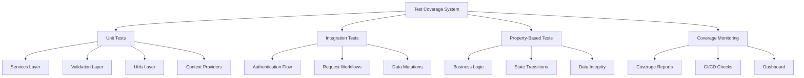
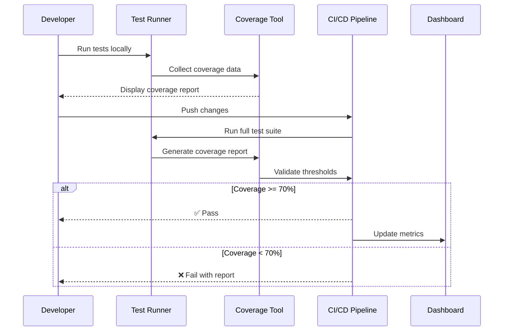
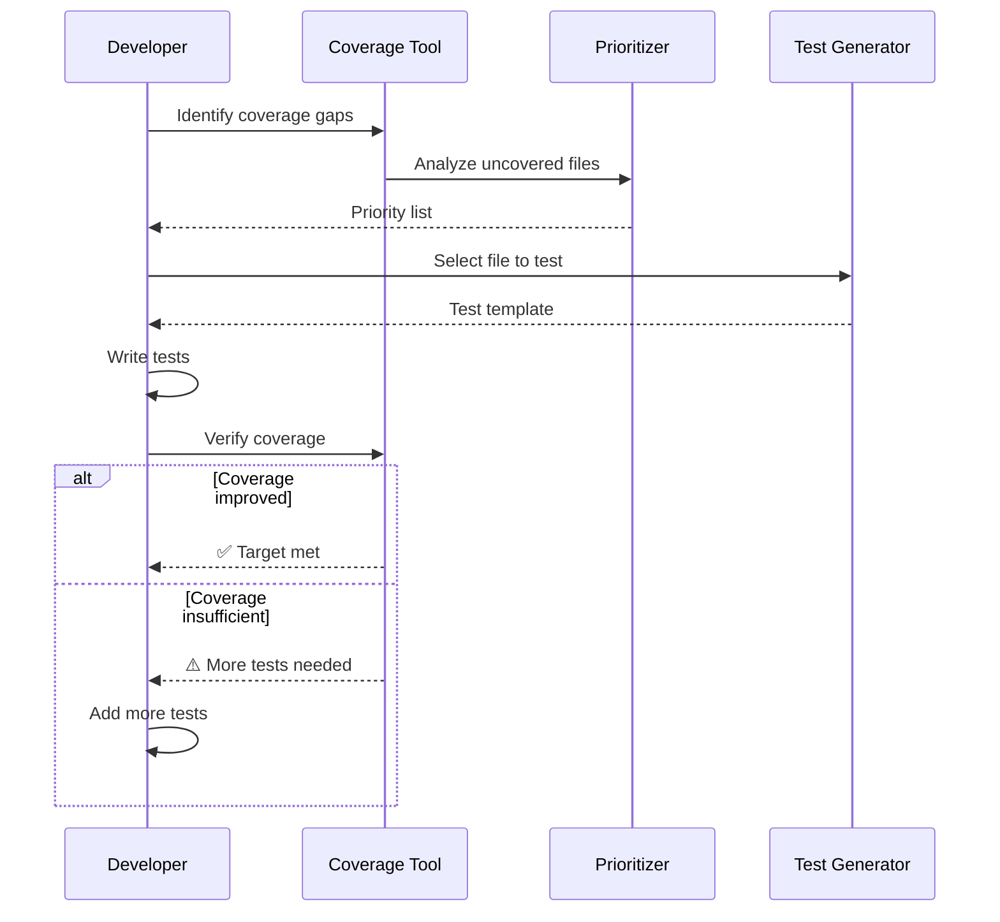

# Design Document: Test Coverage Improvement

## Overview

This design outlines a systematic approach to increase test coverage from the current 24.42% to the target of 70% for the workforce management application. The strategy prioritizes critical services layer (currently at 4.31%), validation layer (0%), and utility functions (partial coverage), while maintaining existing high-coverage areas like hooks (94.73%) and components (72.41%). The approach uses a phased implementation with automated coverage tracking, property-based testing for complex business logic, and integration tests for critical workflows.

## Architecture



## Sequence Diagrams

### Test Execution Flow



### Coverage Improvement Workflow



## Components and Interfaces

### Component 1: Test Suite Manager

**Purpose**: Orchestrates test execution, coverage collection, and reporting

**Interface**:
```typescript
interface TestSuiteManager {
  runTests(options: TestOptions): Promise<TestResults>
  generateCoverageReport(): Promise<CoverageReport>
  validateThresholds(thresholds: CoverageThresholds): ValidationResult
}

interface TestOptions {
  pattern?: string
  watch?: boolean
  coverage?: boolean
  bail?: boolean
}

interface TestResults {
  passed: number
  failed: number
  skipped: number
  duration: number
  coverage?: CoverageData
}

interface CoverageReport {
  overall: CoverageMetrics
  byFile: Map<string, CoverageMetrics>
  byCategory: Map<string, CoverageMetrics>
  uncoveredLines: UncoveredLine[]
}

interface CoverageMetrics {
  lines: { covered: number; total: number; pct: number }
  functions: { covered: number; total: number; pct: number }
  branches: { covered: number; total: number; pct: number }
  statements: { covered: number; total: number; pct: number }
}
```

**Responsibilities**:
- Execute test suites with Vitest
- Collect coverage data using v8 provider
- Generate HTML, JSON, and text reports
- Validate coverage against thresholds
- Provide detailed gap analysis

### Component 2: Service Test Generator

**Purpose**: Generate comprehensive test suites for service layer functions

**Interface**:
```typescript
interface ServiceTestGenerator {
  generateTests(service: ServiceDefinition): TestSuite
  createMocks(dependencies: Dependency[]): MockDefinitions
  generatePropertyTests(service: ServiceDefinition): PropertyTestSuite
}

interface ServiceDefinition {
  name: string
  methods: ServiceMethod[]
  dependencies: Dependency[]
}

interface ServiceMethod {
  name: string
  parameters: Parameter[]
  returnType: TypeDefinition
  sideEffects: SideEffect[]
}

interface TestSuite {
  unitTests: UnitTest[]
  integrationTests: IntegrationTest[]
  propertyTests: PropertyTest[]
}
```

**Responsibilities**:
- Analyze service method signatures
- Generate unit test templates
- Create Supabase mocks
- Generate property-based tests for complex logic
- Handle error scenarios

### Component 3: Coverage Analyzer

**Purpose**: Analyze coverage gaps and prioritize testing efforts

**Interface**:
```typescript
interface CoverageAnalyzer {
  identifyGaps(report: CoverageReport): CoverageGap[]
  prioritizeFiles(gaps: CoverageGap[]): PrioritizedFile[]
  suggestTests(file: string): TestSuggestion[]
  trackProgress(baseline: CoverageReport, current: CoverageReport): ProgressReport
}

interface CoverageGap {
  file: string
  category: string
  currentCoverage: number
  targetCoverage: number
  uncoveredLines: number[]
  priority: Priority
}

interface PrioritizedFile {
  file: string
  priority: Priority
  reason: string
  estimatedTests: number
  impact: number
}

interface TestSuggestion {
  type: 'unit' | 'integration' | 'property'
  description: string
  template: string
  uncoveredLines: number[]
}
```

**Responsibilities**:
- Parse coverage reports
- Identify files below threshold
- Calculate priority based on criticality
- Suggest test types and approaches
- Track coverage improvement over time

### Component 4: CI/CD Integration

**Purpose**: Enforce coverage requirements in continuous integration pipeline

**Interface**:
```typescript
interface CICDIntegration {
  validatePR(pr: PullRequest): ValidationResult
  checkCoverageDelta(baseline: CoverageReport, current: CoverageReport): DeltaResult
  enforceThresholds(thresholds: CoverageThresholds): EnforcementResult
  generateComment(result: ValidationResult): string
}

interface ValidationResult {
  passed: boolean
  overallCoverage: number
  coverageDelta: number
  newCodeCoverage: number
  violations: Violation[]
}

interface DeltaResult {
  delta: number
  acceptable: boolean
  affectedFiles: string[]
}
```

**Responsibilities**:
- Run tests on PR creation
- Compare coverage with baseline
- Enforce minimum thresholds
- Post coverage reports as PR comments
- Block merges if coverage drops significantly

## Data Models

### Model 1: CoverageReport

```typescript
interface CoverageReport {
  timestamp: Date
  commit: string
  overall: CoverageMetrics
  byFile: Record<string, FileCoverage>
  byCategory: Record<string, CoverageMetrics>
  uncoveredLines: UncoveredLine[]
}

interface FileCoverage {
  path: string
  metrics: CoverageMetrics
  uncoveredLines: number[]
  uncoveredFunctions: string[]
  uncoveredBranches: BranchInfo[]
}

interface UncoveredLine {
  file: string
  line: number
  code: string
  reason: string
}

interface BranchInfo {
  line: number
  branch: number
  taken: boolean
}
```

**Validation Rules**:
- timestamp must be valid ISO date
- commit must be valid git SHA
- coverage percentages must be between 0 and 100
- file paths must exist in project

### Model 2: TestConfiguration

```typescript
interface TestConfiguration {
  thresholds: CoverageThresholds
  priorities: PriorityConfig
  exclusions: string[]
  propertyTestConfig: PropertyTestConfig
}

interface CoverageThresholds {
  overall: number
  services: number
  components: number
  utils: number
  criticalPaths: number
  newCode: number
}

interface PriorityConfig {
  p0: string[]  // Critical files
  p1: string[]  // High priority
  p2: string[]  // Medium priority
  p3: string[]  // Low priority
}

interface PropertyTestConfig {
  numRuns: number
  maxSize: number
  seed: number
  timeout: number
}
```

**Validation Rules**:
- All thresholds must be between 0 and 100
- Priority lists must not overlap
- Exclusions must be valid glob patterns
- Property test config values must be positive integers

## Algorithmic Pseudocode

### Main Coverage Improvement Algorithm

```typescript
ALGORITHM improveCoverageToTarget(targetCoverage: number)
INPUT: targetCoverage (target coverage percentage, e.g., 70)
OUTPUT: result indicating success or failure

BEGIN
  ASSERT targetCoverage > 0 AND targetCoverage <= 100
  
  // Step 1: Generate baseline coverage report
  baselineReport ← generateCoverageReport()
  currentCoverage ← baselineReport.overall.lines.pct
  
  ASSERT currentCoverage >= 0 AND currentCoverage <= 100
  
  // Step 2: Identify coverage gaps
  gaps ← identifyGaps(baselineReport, targetCoverage)
  
  // Step 3: Prioritize files for testing
  prioritizedFiles ← prioritizeFiles(gaps)
  
  // Step 4: Process files by priority
  FOR each file IN prioritizedFiles DO
    ASSERT file.priority IN {P0, P1, P2, P3}
    
    // Generate test suggestions
    suggestions ← suggestTests(file)
    
    // Create test files
    FOR each suggestion IN suggestions DO
      testFile ← generateTestFile(file, suggestion)
      writeTestFile(testFile)
    END FOR
    
    // Verify coverage improvement
    newReport ← generateCoverageReport()
    improvement ← newReport.overall.lines.pct - currentCoverage
    
    IF improvement > 0 THEN
      currentCoverage ← newReport.overall.lines.pct
      logProgress(file, improvement)
    END IF
    
    // Check if target reached
    IF currentCoverage >= targetCoverage THEN
      RETURN Success(currentCoverage)
    END IF
  END FOR
  
  // Step 5: Final validation
  finalReport ← generateCoverageReport()
  
  ASSERT finalReport.overall.lines.pct >= baselineReport.overall.lines.pct
  
  IF finalReport.overall.lines.pct >= targetCoverage THEN
    RETURN Success(finalReport.overall.lines.pct)
  ELSE
    RETURN Failure(finalReport.overall.lines.pct, targetCoverage)
  END IF
END
```

**Preconditions:**
- targetCoverage is a valid percentage (0-100)
- Test framework (Vitest) is properly configured
- Coverage tool (v8) is available
- Project has valid test setup

**Postconditions:**
- Coverage report is generated
- Test files are created for identified gaps
- Coverage improves or remains stable
- Final coverage is validated against target

**Loop Invariants:**
- currentCoverage never decreases
- All processed files have associated tests
- Priority order is maintained throughout iteration

### Gap Identification Algorithm

```typescript
ALGORITHM identifyGaps(report: CoverageReport, target: number)
INPUT: report (current coverage report), target (target coverage percentage)
OUTPUT: gaps (array of coverage gaps sorted by priority)

BEGIN
  ASSERT target > 0 AND target <= 100
  ASSERT report.overall.lines.pct >= 0
  
  gaps ← []
  
  // Identify files below target
  FOR each file IN report.byFile DO
    ASSERT file.metrics.lines.pct >= 0 AND file.metrics.lines.pct <= 100
    
    IF file.metrics.lines.pct < target THEN
      gap ← {
        file: file.path,
        category: categorizeFile(file.path),
        currentCoverage: file.metrics.lines.pct,
        targetCoverage: target,
        uncoveredLines: file.uncoveredLines,
        priority: calculatePriority(file)
      }
      gaps.append(gap)
    END IF
  END FOR
  
  // Sort by priority (P0 > P1 > P2 > P3)
  gaps ← sortByPriority(gaps)
  
  ASSERT all gaps have valid priority
  ASSERT gaps are sorted in descending priority order
  
  RETURN gaps
END
```

**Preconditions:**
- report contains valid coverage data
- target is between 0 and 100
- All files in report have valid metrics

**Postconditions:**
- Returns array of gaps sorted by priority
- Each gap has valid priority assignment
- Gaps only include files below target coverage

**Loop Invariants:**
- All processed files have valid coverage metrics
- Gap priority is correctly calculated for each file

### Test Generation Algorithm

```typescript
ALGORITHM generateTestFile(file: string, suggestion: TestSuggestion)
INPUT: file (path to source file), suggestion (test suggestion with type and template)
OUTPUT: testFile (generated test file content)

BEGIN
  ASSERT file exists and is readable
  ASSERT suggestion.type IN {'unit', 'integration', 'property'}
  
  // Step 1: Parse source file
  sourceCode ← readFile(file)
  exports ← extractExports(sourceCode)
  dependencies ← extractDependencies(sourceCode)
  
  // Step 2: Generate test structure
  testFile ← {
    imports: generateImports(exports, dependencies),
    mocks: generateMocks(dependencies),
    setup: generateSetup(file),
    tests: []
  }
  
  // Step 3: Generate tests based on type
  IF suggestion.type = 'unit' THEN
    FOR each export IN exports DO
      IF export.type = 'function' THEN
        testFile.tests.append(generateUnitTest(export))
      ELSE IF export.type = 'class' THEN
        FOR each method IN export.methods DO
          testFile.tests.append(generateUnitTest(method))
        END FOR
      END IF
    END FOR
  ELSE IF suggestion.type = 'integration' THEN
    testFile.tests.append(generateIntegrationTest(exports))
  ELSE IF suggestion.type = 'property' THEN
    testFile.tests.append(generatePropertyTest(exports))
  END IF
  
  // Step 4: Add cleanup
  testFile.cleanup ← generateCleanup(file)
  
  // Step 5: Format and return
  formattedTest ← formatTestFile(testFile)
  
  ASSERT formattedTest is valid TypeScript
  ASSERT formattedTest includes all necessary imports
  
  RETURN formattedTest
END
```

**Preconditions:**
- file exists and is a valid TypeScript file
- suggestion contains valid test type
- Template is available for the test type

**Postconditions:**
- Returns valid TypeScript test file
- Test file includes proper imports and mocks
- Tests cover the suggested uncovered lines
- Test file follows project conventions

**Loop Invariants:**
- All exports are processed
- Each export has corresponding test
- Test structure remains valid throughout generation

## Key Functions with Formal Specifications

### Function 1: generateCoverageReport()

```typescript
function generateCoverageReport(): Promise<CoverageReport>
```

**Preconditions:**
- Vitest is configured with coverage provider
- Test files exist and are executable
- Coverage configuration is valid

**Postconditions:**
- Returns valid CoverageReport object
- Report contains overall and per-file metrics
- All coverage percentages are between 0 and 100
- Report timestamp is current

**Loop Invariants:** N/A (no loops in function)

### Function 2: prioritizeFiles()

```typescript
function prioritizeFiles(gaps: CoverageGap[]): PrioritizedFile[]
```

**Preconditions:**
- gaps is non-empty array
- Each gap has valid priority field
- Each gap has valid file path

**Postconditions:**
- Returns array sorted by priority (P0 first)
- All input gaps are represented in output
- Each file has estimated test count
- Impact score is calculated for each file

**Loop Invariants:**
- All processed gaps maintain their priority
- Sorting order is preserved

### Function 3: validateThresholds()

```typescript
function validateThresholds(
  report: CoverageReport,
  thresholds: CoverageThresholds
): ValidationResult
```

**Preconditions:**
- report contains valid coverage data
- thresholds contains valid percentage values (0-100)
- All threshold categories are defined

**Postconditions:**
- Returns validation result with pass/fail status
- Lists all violations if any exist
- Calculates delta from thresholds
- No mutations to input parameters

**Loop Invariants:**
- All threshold categories are checked
- Violation list grows monotonically

### Function 4: generateServiceTest()

```typescript
function generateServiceTest(
  servicePath: string,
  method: ServiceMethod
): string
```

**Preconditions:**
- servicePath points to valid service file
- method contains valid signature
- Service uses Supabase client

**Postconditions:**
- Returns valid TypeScript test code
- Test includes proper mocks for Supabase
- Test covers success and error cases
- Test follows project conventions

**Loop Invariants:**
- All method parameters are tested
- All return paths are covered

## Example Usage

```typescript
// Example 1: Generate coverage report
const report = await generateCoverageReport()
console.log(`Overall coverage: ${report.overall.lines.pct}%`)

// Example 2: Identify and prioritize gaps
const gaps = identifyGaps(report, 70)
const prioritized = prioritizeFiles(gaps)

console.log(`Found ${gaps.length} files below target`)
console.log(`Top priority: ${prioritized[0].file}`)

// Example 3: Generate tests for a service
const servicePath = 'src/services/authService.ts'
const suggestions = suggestTests(servicePath)

for (const suggestion of suggestions) {
  const testFile = generateTestFile(servicePath, suggestion)
  const testPath = servicePath.replace('src/', 'src/test/').replace('.ts', '.test.ts')
  await writeFile(testPath, testFile)
}

// Example 4: Validate coverage in CI
const thresholds = {
  overall: 70,
  services: 70,
  components: 70,
  utils: 70,
  criticalPaths: 90,
  newCode: 80
}

const validation = validateThresholds(report, thresholds)

if (!validation.passed) {
  console.error('Coverage validation failed:')
  validation.violations.forEach(v => console.error(`  - ${v.message}`))
  process.exit(1)
}

// Example 5: Track progress over time
const baseline = await loadBaselineReport()
const current = await generateCoverageReport()
const progress = trackProgress(baseline, current)

console.log(`Coverage improved by ${progress.delta}%`)
console.log(`Files improved: ${progress.improvedFiles.length}`)
```

## Correctness Properties

### Property 1: Coverage Monotonicity
```typescript
// Coverage should never decrease when adding tests
∀ baseline, current: CoverageReport.
  (current.timestamp > baseline.timestamp) ⟹
  (current.overall.lines.pct >= baseline.overall.lines.pct)
```

### Property 2: Test Completeness
```typescript
// Every exported function should have at least one test
∀ file: SourceFile, export: Export.
  (export ∈ file.exports) ⟹
  (∃ test: Test. test.targets(export))
```

### Property 3: Threshold Enforcement
```typescript
// CI should fail if coverage drops below threshold
∀ report: CoverageReport, threshold: number.
  (report.overall.lines.pct < threshold) ⟹
  (validateThresholds(report, {overall: threshold}).passed = false)
```

### Property 4: Priority Ordering
```typescript
// P0 files should be tested before P1, P1 before P2, etc.
∀ files: PrioritizedFile[].
  (files = prioritizeFiles(gaps)) ⟹
  (∀ i, j. (i < j ∧ files[i].priority = P0 ∧ files[j].priority = P1) ⟹ true)
```

### Property 5: Gap Identification Accuracy
```typescript
// All files below target should be identified as gaps
∀ report: CoverageReport, target: number, file: FileCoverage.
  (file.metrics.lines.pct < target) ⟹
  (file ∈ identifyGaps(report, target))
```

### Property 6: Test Generation Validity
```typescript
// Generated tests should be syntactically valid TypeScript
∀ file: string, suggestion: TestSuggestion.
  (testCode = generateTestFile(file, suggestion)) ⟹
  (isValidTypeScript(testCode) = true)
```

### Property 7: Mock Consistency
```typescript
// Mocked dependencies should match actual dependencies
∀ service: ServiceDefinition.
  (mocks = createMocks(service.dependencies)) ⟹
  (mocks.keys() = service.dependencies.map(d => d.name))
```

### Property 8: Coverage Delta Accuracy
```typescript
// Coverage delta should accurately reflect change
∀ baseline, current: CoverageReport.
  (delta = checkCoverageDelta(baseline, current)) ⟹
  (delta.delta = current.overall.lines.pct - baseline.overall.lines.pct)
```

## Error Handling

### Error Scenario 1: Test Execution Failure

**Condition**: Tests fail during execution
**Response**: 
- Capture error details and stack trace
- Log failed test names and reasons
- Generate failure report
- Do not update coverage metrics

**Recovery**: 
- Fix failing tests
- Re-run test suite
- Verify all tests pass before proceeding

### Error Scenario 2: Coverage Tool Unavailable

**Condition**: v8 coverage provider not installed or configured
**Response**:
- Display clear error message
- Provide installation instructions
- Exit with non-zero code

**Recovery**:
- Install @vitest/coverage-v8
- Verify vite.config.ts has coverage configuration
- Re-run tests

### Error Scenario 3: Invalid Coverage Threshold

**Condition**: Threshold value outside 0-100 range
**Response**:
- Throw validation error
- Display invalid threshold value
- Suggest valid range

**Recovery**:
- Update configuration with valid threshold
- Re-run validation

### Error Scenario 4: File Not Found

**Condition**: Source file or test file path is invalid
**Response**:
- Log file path that was not found
- Skip file in processing
- Continue with remaining files

**Recovery**:
- Verify file paths in configuration
- Update paths if files were moved
- Re-run coverage analysis

### Error Scenario 5: Supabase Mock Failure

**Condition**: Mock setup fails for Supabase client
**Response**:
- Log mock setup error
- Provide example of correct mock structure
- Skip test generation for that service

**Recovery**:
- Review Supabase client usage in service
- Update mock template
- Regenerate tests

## Testing Strategy

### Unit Testing Approach

Focus on testing individual functions and methods in isolation:

**Services Layer** (Priority P0):
- Mock Supabase client responses
- Test success paths with valid data
- Test error paths with invalid data
- Test edge cases (empty arrays, null values, etc.)
- Verify correct query construction
- Target: 70% coverage minimum

**Validation Layer** (Priority P0):
- Test schema validation with valid inputs
- Test schema validation with invalid inputs
- Test boundary conditions
- Test error message generation
- Target: 70% coverage minimum

**Utils Layer** (Priority P1):
- Test pure functions with various inputs
- Test date manipulation functions
- Test formatting functions
- Test CSV parsing and generation
- Target: 70% coverage minimum

**Context Providers** (Priority P1):
- Test state management
- Test context value updates
- Test provider composition
- Target: 70% coverage minimum

### Property-Based Testing Approach

Use fast-check library for property-based testing of complex business logic:

**Property Test Library**: fast-check (already installed)

**Business Logic Properties**:
- Approval workflow state transitions are valid
- Leave balance calculations are consistent
- Auto-distribution maintains coverage requirements
- Data integrity constraints are preserved
- Search and filter operations are idempotent

**Example Properties**:
```typescript
// Property: Leave balance never goes negative
fc.assert(
  fc.property(
    fc.record({
      balance: fc.nat(100),
      deduction: fc.nat(50)
    }),
    (data) => {
      const result = deductLeaveBalance(data.balance, data.deduction)
      return result >= 0
    }
  )
)

// Property: Auto-distribution maintains total coverage
fc.assert(
  fc.property(
    fc.array(fc.record({
      agentId: fc.uuid(),
      availability: fc.nat(100)
    })),
    (agents) => {
      const distribution = autoDistributeBreaks(agents)
      const totalBefore = agents.reduce((sum, a) => sum + a.availability, 0)
      const totalAfter = distribution.reduce((sum, d) => sum + d.assigned, 0)
      return totalBefore === totalAfter
    }
  )
)
```

**Configuration**:
- Number of runs: 100 per property
- Max size: 50 (for generated arrays/objects)
- Seed: Random (reproducible on failure)
- Timeout: 5000ms per property

### Integration Testing Approach

Test complete workflows end-to-end with real Supabase local instance:

**Critical Workflows** (Priority P0):
- Authentication flow (login → session → logout)
- Leave request creation → approval → balance deduction
- Swap request creation → approval → shift update
- Break schedule auto-distribution → validation → save

**Integration Test Structure**:
- Use Supabase local instance (not mocks)
- Seed test data before each test
- Clean up test data after each test
- Test happy paths and error paths
- Verify database state changes
- Target: 90% coverage for critical paths

**Example Integration Test**:
```typescript
describe('Leave Request Flow', () => {
  let testUserId: string
  
  beforeEach(async () => {
    // Seed test data
    const user = await createTestUser()
    testUserId = user.id
    await createLeaveBalance(testUserId, 20)
  })
  
  afterEach(async () => {
    // Cleanup
    await deleteTestUser(testUserId)
  })
  
  it('should create, approve, and deduct balance', async () => {
    // Create request
    const request = await createLeaveRequest({
      userId: testUserId,
      startDate: '2026-01-01',
      endDate: '2026-01-05',
      days: 5
    })
    
    // Approve request
    await approveLeaveRequest(request.id)
    
    // Verify balance deducted
    const balance = await getLeaveBalance(testUserId)
    expect(balance.remaining).toBe(15)
  })
})
```

## Performance Considerations

**Test Execution Time**:
- Target: < 30 seconds for full test suite
- Use parallel test execution (Vitest default)
- Mock external dependencies (Supabase in unit tests)
- Use Supabase local instance for integration tests (faster than remote)

**Coverage Report Generation**:
- Target: < 10 seconds for coverage report
- Use v8 provider (faster than istanbul)
- Generate HTML report only on demand
- Use JSON report for CI/CD validation

**CI/CD Pipeline**:
- Cache node_modules between runs
- Cache Vitest cache directory
- Run tests in parallel across multiple workers
- Only run affected tests on PR (future optimization)

**Memory Usage**:
- Limit concurrent test workers based on available memory
- Clean up test data aggressively
- Use smaller test datasets where possible

## Security Considerations

**Test Data**:
- Never use production data in tests
- Use fake data generators for PII
- Sanitize any real data used in test fixtures
- Store test credentials in environment variables

**Supabase Local Instance**:
- Use separate test database
- Use service role key only in test environment
- Never commit test credentials to repository
- Reset database between test runs

**Coverage Reports**:
- Do not expose coverage reports publicly
- Store coverage data securely in CI/CD
- Limit access to coverage dashboard
- Sanitize file paths in reports

**Mocking**:
- Ensure mocks don't bypass security checks
- Test authentication and authorization separately
- Verify RLS policies in integration tests
- Don't mock security-critical functions

## Dependencies

**Testing Framework**:
- vitest: ^4.0.18 (already installed)
- @vitest/coverage-v8: ^4.0.18 (already installed)
- jsdom: ^28.0.0 (already installed)

**Testing Libraries**:
- @testing-library/react: ^16.3.2 (already installed)
- @testing-library/user-event: ^14.6.1 (already installed)
- @testing-library/jest-dom: ^6.9.1 (already installed)
- fast-check: ^4.5.3 (already installed)

**Supabase**:
- @supabase/supabase-js: ^2.39.0 (already installed)
- Supabase CLI for local instance

**CI/CD**:
- GitHub Actions (existing)
- Coverage reporting service (optional: Codecov, Coveralls)

**Development Tools**:
- TypeScript: ~5.6.2 (already installed)
- ESLint: ^9.17.0 (already installed)
- Prettier: ^3.8.1 (already installed)
