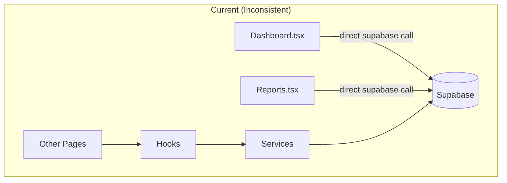
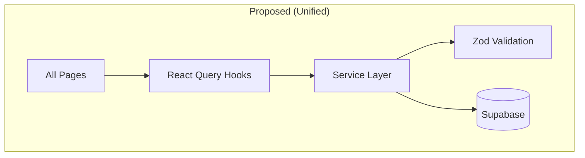

# WFM — Design Document

Proposed solutions for all requirements identified in the audit. Organized by priority tier.

---

## P0 · Security Fixes

### SEC-01 — Secret Removal

**Approach:** Create a `.env.test` file (git-ignored) for test credentials. Reference via `dotenv` in vitest config.

```diff
 // vite.config.ts → test.env
-  VITE_SUPABASE_TEST_URL: 'http://127.0.0.1:54321',
-  VITE_SUPABASE_TEST_ANON_KEY: 'sb_publishable_...',
-  VITE_SUPABASE_TEST_SERVICE_KEY: 'sb_secret_...',
+  // Loaded from .env.test via vitest envFile option
```

```diff
 // .env.example — remove actual keys
-VITE_SUPABASE_TEST_ANON_KEY=sb_publishable_ACJWlzQHlZjBrEguHvfOxg_3BJgxAaH
-VITE_SUPABASE_TEST_SERVICE_KEY=sb_secret_N7UND0UgjKTVK-Uodkm0Hg_xSvEMPvz
+VITE_SUPABASE_TEST_ANON_KEY=your-local-test-anon-key
+VITE_SUPABASE_TEST_SERVICE_KEY=your-local-test-service-key
```

**Files:** `vite.config.ts`, `.env.example`, new `.env.test`, `.gitignore`

---

### SEC-02 — CSP Hardening

**Approach:** Remove `unsafe-eval` entirely. Replace `unsafe-inline` with nonce-based or `strict-dynamic` approach. If Vite injects inline scripts at build time, use hash-based CSP.

```diff
 // vercel.json
-"script-src 'self' 'unsafe-inline' 'unsafe-eval'"
+"script-src 'self' 'strict-dynamic'"
 // style-src can keep 'unsafe-inline' if Tailwind uses runtime injection
```

> [!IMPORTANT]
> Test thoroughly after CSP changes — Vite, React, and Tailwind may inject inline styles/scripts that break under strict CSP.

---

### SEC-03 — Server-Side Security Logging

**Approach:** Create a `security_events` Supabase table. Log events via an RPC call or direct insert. Keep the dev-mode `console.warn` for local debugging.

```
security_events table:
  id UUID PK
  user_id UUID FK → auth.users
  action TEXT (unauthorized_access | domain_violation | role_violation)
  route TEXT
  metadata JSONB
  created_at TIMESTAMPTZ DEFAULT now()
```

**Files:** `src/lib/securityLogger.ts`, new migration file

---

### SEC-04 — Proper Sentry Integration

**Approach:** Refactor `sentry.ts` to do `Sentry.init()` with proper config. Import `Sentry` from `@sentry/react` in `errorHandler.ts` and `securityLogger.ts`.

```typescript
// src/lib/sentry.ts
import * as Sentry from '@sentry/react'

export function initSentry() {
  const dsn = import.meta.env.VITE_SENTRY_DSN
  if (!dsn) return

  Sentry.init({
    dsn,
    environment: import.meta.env.VITE_SENTRY_ENVIRONMENT || 'development',
    integrations: [Sentry.browserTracingIntegration()],
    tracesSampleRate: 0.1,
  })
}

export { Sentry }
```

Then import `{ Sentry }` everywhere instead of `(window as any).Sentry`.

**Files:** `src/lib/sentry.ts`, `src/lib/errorHandler.ts`, `src/lib/securityLogger.ts`, `src/main.tsx`

---

### SEC-05 — Missing Security Migrations

**Approach:** Write the two migration files based on the instructions in `SECURITY-FIX-INSTRUCTIONS.md`:

1. **`XXX_fix_rls_user_metadata.sql`** — Change all RLS policies from `auth.jwt()->>'role'` (user_metadata) to `(auth.jwt()->'app_metadata'->>'role')`.
2. **`XXX_fix_security_definer_views.sql`** — Change the three views from `SECURITY DEFINER` to `SECURITY INVOKER`.

**Files:** `supabase/migrations/`, `SECURITY-FIX-INSTRUCTIONS.md` (update to mark as resolved)

---

## P1 · Architecture Refactoring

### ARCH-01 — Component Decomposition

**Settings.tsx → split into:**

| New Component | Lines | Responsibility |
|--------------|-------|----------------|
| `Settings/GeneralSettings.tsx` | ~80 | Auto-approve, exceptions toggles |
| `Settings/LeaveTypeManager.tsx` | ~150 | Leave type CRUD |
| `Settings/BreakScheduleSettings.tsx` | ~100 | Break schedule config |
| `Settings/ShiftConfigSettings.tsx` | ~100 | Shift configuration |
| `Settings/index.tsx` | ~80 | Tab navigation shell |

**Reports.tsx → split into:**

| New Component | Lines | Responsibility |
|--------------|-------|----------------|
| `Reports/ReportFilters.tsx` | ~60 | Date range selector |
| `Reports/MetricCards.tsx` | ~80 | Summary cards |
| `Reports/SwapChart.tsx` | ~60 | Swap bar chart |
| `Reports/LeaveChart.tsx` | ~60 | Leave pie chart |
| `Reports/useReportData.ts` | ~80 | Data fetching hook (React Query) |
| `Reports/index.tsx` | ~60 | Layout orchestrator |

---

### ARCH-02 — Unified Data-Fetching

Create missing hooks:

```typescript
// src/hooks/useReportData.ts
export function useReportData(dateRange: DateRange) {
  return useQuery({
    queryKey: ['reports', dateRange],
    queryFn: () => reportsService.getMetrics(dateRange),
  })
}

// src/hooks/useDashboardData.ts
export function useDashboardData() {
  return useQuery({
    queryKey: ['dashboard'],
    queryFn: () => dashboardService.getPendingItems(),
  })
}
```

Create corresponding services: `reportsService.ts`, `dashboardService.ts`.

---

### ARCH-03 — Dynamic LeaveType

```diff
 // src/types/index.ts
-export type LeaveType = 'sick' | 'annual' | 'casual' | 'public_holiday' | 'bereavement'
+export type LeaveType = string  // Dynamically loaded from leave_types table

 // src/utils/validation.ts — validateLeaveType()
-const validLeaveTypes: LeaveType[] = ['sick', 'annual', ...]
-if (!validLeaveTypes.includes(leaveType as LeaveType)) { ... }
+// Remove sync validation. Use useLeaveTypes() hook for runtime validation.
+// Or make it async: validateLeaveTypeAsync(leaveType)
```

**Trade-off:** Losing compile-time exhaustiveness checks. Mitigate with runtime validation and integration tests.

---

### ARCH-04 — Consolidated Validation

**Proposed structure:**

```
src/validation/
  ├── schemas/           # Zod schemas (source of truth)
  │   ├── leaveRequest.ts
  │   ├── swapRequest.ts
  │   ├── user.ts
  │   └── common.ts      # UUID, date, email schemas
  ├── validators.ts      # Derived imperative validators from schemas
  └── index.ts           # Barrel file
```

Delete: `utils/validation.ts`, `utils/validators.ts`, `lib/validations/`, `services/validation/`.

---

### ARCH-05 — Export breakSchedulesService

```diff
 // src/services/index.ts
 export * from './breakRulesService'
+export * from './breakSchedulesService'
 export * from './shiftConfigurationsService'
```

---

## P2 · Code Quality Fixes

### CQ-01 through CQ-07

All straightforward single-file edits:

| ID | Change | Effort |
|----|--------|--------|
| CQ-01 | `"name": "swaptool"` → `"name": "wfm"` | 1 min |
| CQ-02 | Delete comment line 129 in `types/index.ts` | 1 min |
| CQ-03 | Replace inline key in `Layout.tsx` with `STORAGE_KEYS.SIDEBAR_COLLAPSED` | 5 min |
| CQ-04 | Remove `/new` routes from `App.tsx` | 5 min |
| CQ-05 | Wrap `<ReactQueryDevtools>` in `{import.meta.env.DEV && ...}` | 2 min |
| CQ-06 | Create `NotFound.tsx`, update catch-all route | 15 min |
| CQ-07 | Add `coverage/` to `.gitignore`, `git rm -r --cached coverage/` | 5 min |

---

## P3 · Database Fixes

### DB-01/02 — Migration Renumbering

**Proposed new naming (timestamp-based):**

```
20250101_001_base_schema.sql          (current schema.sql)
20250201_003_comments_and_settings.sql
20250201_004_phase4.sql
20250301_005_swap_rls.sql
20250301_006_swap_original_shift.sql
20250301_007a_denied_status.sql
20250301_007b_swap_additional_shifts.sql
20250401_008_atomic_swap.sql
20250401_009_system_comment_protection.sql
20250401_010_performance_indexes.sql
20250501_011_remove_fte.sql
20250601_012_fix_security_warnings.sql    ← NEW
20250601_013_sync_role_metadata.sql       ← NEW
20250601_014_centralized_leave_types.sql
20250701_015_break_schedules.sql
20250801_020_shift_configurations.sql
20250801_021_fix_auth_trigger.sql
20250801_022_verify_fix_signup.sql
20250801_023_fix_leave_types_signup.sql
```

Add `supabase/migrations/README.md` documenting the order.

---

## P4/P5 · Testing & Polish

Detailed in [tasks.md](./tasks.md) — these are lower priority and can be addressed incrementally.

---

## Architectural Diagram — Current vs Proposed




