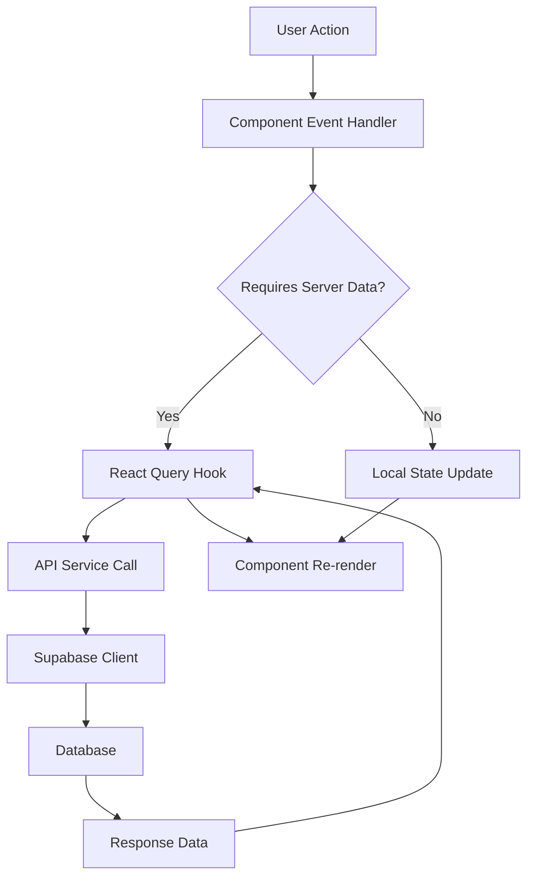

# Design Document: WFM v2 UI Redesign

## Overview

This design document outlines the technical approach for redesigning the WFM application UI to match the modern WFM v2 design. The redesign focuses on visual consistency, improved information density, and enhanced user experience while preserving all existing functionality. The implementation will be incremental, updating components and pages systematically to minimize disruption.

The redesign includes:
- Sidebar layout restructuring with fixed expansion and bottom-aligned user controls
- Dashboard enhancement with stat cards and coverage visualization
- Schedule page improvements with view toggle and enhanced visual design
- New unified Request Management page combining swap and leave requests
- Consistent styling updates across all pages
- Employee edit popup modal for inline editing

## Architecture

### Component Structure

The redesign follows the existing React component architecture with enhancements:

```
src/
├── components/
│   ├── Layout.tsx (MODIFIED - sidebar redesign)
│   ├── StatCard.tsx (NEW - dashboard statistics)
│   ├── CoverageChart.tsx (NEW - coverage visualization)
│   ├── RequestTable.tsx (NEW - unified request display)
│   ├── TypeBadge.tsx (NEW - request type indicator)
│   ├── StatusBadge.tsx (MODIFIED - enhanced styling)
│   ├── ViewToggle.tsx (NEW - schedule view switcher)
│   ├── EmployeeEditModal.tsx (NEW - employee edit popup)
│   └── ...existing components
├── pages/
│   ├── Dashboard.tsx (MODIFIED - stat cards + coverage)
│   ├── Schedule/
│   │   └── Schedule.tsx (MODIFIED - view toggle + filters)
│   ├── RequestManagement.tsx (NEW - unified requests)
│   ├── SwapRequests/
│   │   └── SwapRequests.tsx (MODIFIED - styling update)
│   ├── LeaveRequests/
│   │   └── LeaveRequests.tsx (MODIFIED - styling update)
│   └── Headcount/
│       └── EmployeeDirectory.tsx (MODIFIED - popup integration)
├── hooks/
│   ├── useDashboardStats.ts (NEW - stat calculations)
│   ├── useCoverageData.ts (NEW - coverage calculations)
│   └── useScheduleView.ts (NEW - view state management)
└── lib/
    └── designSystem.ts (MODIFIED - new color constants)
```

### State Management

The redesign maintains the existing state management approach:
- React Query for server state (existing)
- Local component state for UI interactions (existing)
- LocalStorage for user preferences (view toggle, sidebar state)
- Context API for theme/auth (existing)

### Data Flow



## Components and Interfaces

### 1. Layout Component (Modified)

**Purpose:** Restructure sidebar to always-expanded state with bottom-aligned user controls

**Interface:**
```typescript
interface LayoutProps {
  children: React.ReactNode
}

// Remove sidebarCollapsed state
// Add bottom section for user controls
```

**Key Changes:**
- Remove collapse/expand toggle functionality
- Remove `sidebarCollapsed` state and localStorage persistence
- Fixed width sidebar (w-64 instead of dynamic w-20/w-48)
- Add bottom section container for user profile, dark mode toggle, sign out
- Update main content margin to fixed `ml-64`

### 2. StatCard Component (New)

**Purpose:** Display dashboard statistics with icon and colored background

**Interface:**
```typescript
interface StatCardProps {
  title: string
  value: number | string
  icon: React.ElementType
  bgColor: string // Tailwind color class
  iconColor: string // Tailwind color class
  onClick?: () => void
}

export function StatCard({ title, value, icon: Icon, bgColor, iconColor, onClick }: StatCardProps): JSX.Element
```

**Implementation:**
```typescript
export function StatCard({ title, value, icon: Icon, bgColor, iconColor, onClick }: StatCardProps) {
  return (
    <div 
      className={`bg-white rounded-lg shadow p-6 ${onClick ? 'cursor-pointer hover:shadow-md transition-shadow' : ''}`}
      onClick={onClick}
    >
      <div className="flex items-center justify-between">
        <div>
          <p className="text-sm font-medium text-gray-600">{title}</p>
          <p className="text-3xl font-bold text-gray-900 mt-2">{value}</p>
        </div>
        <div className={`${bgColor} rounded-lg p-3`}>
          <Icon className={`w-8 h-8 ${iconColor}`} />
        </div>
      </div>
    </div>
  )
}
```

### 3. CoverageChart Component (New)

**Purpose:** Visualize daily staffing coverage for the week

**Interface:**
```typescript
interface CoverageData {
  day: string // 'Mon', 'Tue', etc.
  count: number
  level: 'adequate' | 'low' | 'critical'
}

interface CoverageChartProps {
  data: CoverageData[]
}

export function CoverageChart({ data }: CoverageChartProps): JSX.Element
```

**Implementation:**
- Use simple HTML/CSS bar chart (no external charting library)
- Color coding: adequate (green), low (yellow), critical (red)
- Responsive design with horizontal scrolling on mobile

### 4. RequestTable Component (New)

**Purpose:** Unified table display for swap and leave requests

**Interface:**
```typescript
interface RequestTableRow {
  id: string
  type: 'swap' | 'leave'
  requester: {
    id: string
    name: string
    avatar?: string
  }
  details: string // "→ John Doe" for swaps, "Jan 15 - Jan 20" for leave
  status: RequestStatus
  actions: RequestAction[]
}

interface RequestTableProps {
  requests: RequestTableRow[]
  onRowClick: (id: string, type: 'swap' | 'leave') => void
  onAction: (id: string, action: RequestAction) => Promise<void>
  loading?: boolean
}

export function RequestTable({ requests, onRowClick, onAction, loading }: RequestTableProps): JSX.Element
```

**Columns:**
1. Requester (avatar + name)
2. Type (TypeBadge)
3. Details (context-specific)
4. Status (StatusBadge)
5. Actions (conditional buttons)

### 5. TypeBadge Component (New)

**Purpose:** Display request type with color coding

**Interface:**
```typescript
type RequestType = 'swap' | 'leave'

interface TypeBadgeProps {
  type: RequestType
}

export function TypeBadge({ type }: TypeBadgeProps): JSX.Element
```

**Styling:**
- Swap: `bg-blue-100 text-blue-800 border-blue-200`
- Leave: `bg-orange-100 text-orange-800 border-orange-200`

### 6. ViewToggle Component (New)

**Purpose:** Switch between weekly and monthly schedule views

**Interface:**
```typescript
type ScheduleView = 'weekly' | 'monthly'

interface ViewToggleProps {
  value: ScheduleView
  onChange: (view: ScheduleView) => void
}

export function ViewToggle({ value, onChange }: ViewToggleProps): JSX.Element
```

**Implementation:**
- Segmented control design
- Persist selection to localStorage
- Smooth transition between views

### 7. EmployeeEditModal Component (New)

**Purpose:** Popup modal for editing employee information

**Interface:**
```typescript
interface EmployeeEditModalProps {
  employee: Employee | null
  isOpen: boolean
  onClose: () => void
  onSave: (employee: Partial<Employee>) => Promise<void>
}

interface Employee {
  id: string
  name: string
  email: string
  role: 'agent' | 'tl' | 'wfm'
  team?: string
  // Additional fields as configured
}

export function EmployeeEditModal({ employee, isOpen, onClose, onSave }: EmployeeEditModalProps): JSX.Element
```

**Features:**
- Modal overlay with backdrop
- Form validation
- Loading state during save
- Error display
- Close on backdrop click or Cancel button

## Data Models

### Dashboard Statistics

```typescript
interface DashboardStats {
  totalStaff: number
  activeShifts: number
  pendingRequests: number
  openSwaps: number
}
```

**Calculation Logic:**
- `totalStaff`: Count of users with role 'agent' and active status
- `activeShifts`: Count of shifts where date = today
- `pendingRequests`: Count of leave_requests where status starts with 'pending'
- `openSwaps`: Count of swap_requests where status = 'pending_acceptance' or starts with 'pending'

### Coverage Data

```typescript
interface DailyCoverage {
  date: string // ISO date
  dayName: string // 'Mon', 'Tue', etc.
  scheduledCount: number
  onLeaveCount: number
  netCoverage: number
  level: 'adequate' | 'low' | 'critical'
}

interface WeeklyCoverage {
  weekStart: string // ISO date
  weekEnd: string // ISO date
  days: DailyCoverage[]
}
```

**Calculation Logic:**
```typescript
function calculateDailyCoverage(date: string): DailyCoverage {
  const scheduledCount = shifts.filter(s => s.date === date).length
  const onLeaveCount = approvedLeaves.filter(l => 
    date >= l.start_date && date <= l.end_date
  ).length
  const netCoverage = scheduledCount - onLeaveCount
  
  const level = netCoverage >= 20 ? 'adequate' 
              : netCoverage >= 15 ? 'low' 
              : 'critical'
  
  return { date, dayName, scheduledCount, onLeaveCount, netCoverage, level }
}
```

### Schedule View State

```typescript
interface ScheduleViewState {
  view: 'weekly' | 'monthly'
  currentDate: Date
  selectedTeam: string | 'all'
  selectedAgent: string | 'all'
}
```

### Unified Request Data

```typescript
interface UnifiedRequest {
  id: string
  type: 'swap' | 'leave'
  requester: User
  status: RequestStatus
  createdAt: string
  
  // Swap-specific
  targetUser?: User
  requesterShift?: Shift
  targetShift?: Shift
  
  // Leave-specific
  leaveType?: string
  startDate?: string
  endDate?: string
  notes?: string
}
```

## Correctness Properties

*A property is a characteristic or behavior that should hold true across all valid executions of a system—essentially, a formal statement about what the system should do. Properties serve as the bridge between human-readable specifications and machine-verifiable correctness guarantees.*


### Property Reflection

After analyzing all acceptance criteria, I've identified the following testable properties. Many UI structure and integration test criteria are better suited for manual testing or E2E tests rather than property-based testing. The properties below focus on:
1. Calculation logic (stats, coverage, filtering)
2. Rendering consistency (badges, cells, components)
3. Conditional rendering logic (permissions, roles)
4. Accessibility requirements (contrast, keyboard navigation)

Redundancies eliminated:
- Multiple shift color properties (7.3-7.6) can be combined into one property about shift type to color mapping
- Multiple status badge color properties (9.1-9.5) can be combined into one property about status to color mapping
- Request rendering properties (3.3-3.7, 8.3-8.6) share similar logic and can be consolidated
- Filter properties (6.3-6.4) can be combined into one property about filtering correctness

### Correctness Properties

Property 1: Active Shifts Calculation
*For any* set of shifts and a given date, the active shifts count should equal the number of shifts where the shift date matches the given date
**Validates: Requirements 2.3**

Property 2: Pending Requests Calculation
*For any* set of leave requests, the pending requests count should equal the number of requests where the status starts with "pending"
**Validates: Requirements 2.4**

Property 3: Open Swaps Calculation
*For any* set of swap requests, the open swaps count should equal the number of requests where the status is "pending_acceptance" or starts with "pending"
**Validates: Requirements 2.5**

Property 4: Request List Merging
*For any* set of swap requests and leave requests, the unified request list should contain all requests from both sets with correct type indicators
**Validates: Requirements 3.2, 8.2**

Property 5: Request Rendering Completeness
*For any* request in the unified list, the rendered output should contain the requester name, type badge, status badge, and type-appropriate details (target user for swaps, date range for leave)
**Validates: Requirements 3.3, 3.4, 3.5, 3.6, 3.7, 8.3, 8.4, 8.5, 8.6**

Property 6: Recent Requests Limit
*For any* set of requests greater than 10, the recent requests display should contain exactly 10 items, sorted by creation date descending
**Validates: Requirements 3.8**

Property 7: Coverage Calculation
*For any* date and set of shifts and approved leaves, the net coverage should equal the count of shifts on that date minus the count of employees on approved leave that overlaps that date
**Validates: Requirements 4.3**

Property 8: Coverage Level Classification
*For any* net coverage value, the level should be "adequate" if >= 20, "low" if >= 15 and < 20, or "critical" if < 15
**Validates: Requirements 4.4**

Property 9: Schedule View Persistence
*For any* view selection ("weekly" or "monthly"), after saving to localStorage and reloading, the restored view should match the saved selection
**Validates: Requirements 5.4, 5.5**

Property 10: Team Filter Correctness
*For any* selected team and set of employees, all displayed employees should belong to the selected team, and no employees from other teams should be displayed
**Validates: Requirements 6.3**

Property 11: Agent Filter Correctness
*For any* selected agent and set of employees, exactly one employee should be displayed and that employee's ID should match the selected agent ID
**Validates: Requirements 6.4**

Property 12: Shift Cell Rendering
*For any* shift, the rendered cell should contain the shift type name and a time range in HH:MM - HH:MM format
**Validates: Requirements 7.1, 7.2**

Property 13: Shift Color Mapping
*For any* shift type (Morning, Day, Evening, Night), the rendered cell should have the corresponding background color (light blue, blue, purple, dark respectively)
**Validates: Requirements 7.3, 7.4, 7.5, 7.6**

Property 14: Status Badge Color Mapping
*For any* request status, the status badge should display the correct color: approved=green, pending_tl=yellow, pending_wfm=yellow, pending_acceptance=blue, rejected=red
**Validates: Requirements 9.1, 9.2, 9.3, 9.4, 9.5**

Property 15: Type Badge Color Mapping
*For any* request type, the type badge should display "Swap" with blue background for swap requests and "Leave" with orange background for leave requests
**Validates: Requirements 10.1, 10.2**

Property 16: Type Badge Consistency
*For any* two type badges of the same type rendered in different contexts, they should have identical styling (size, padding, border-radius, font-weight)
**Validates: Requirements 10.4**

Property 17: Action Button Visibility for Managers
*For any* request with status "pending_tl" or "pending_wfm" and user with role TL or WFM, the rendered actions should include "Approve" and "Reject" buttons
**Validates: Requirements 11.1**

Property 18: Revoke Button Visibility for Requesters
*For any* request with pending status where the current user is the requester, the rendered actions should include a "Revoke" button
**Validates: Requirements 11.2**

Property 19: Keyboard Navigation Completeness
*For any* interactive element (button, link, input, select), it should have a tabIndex that allows keyboard focus, or be a naturally focusable element
**Validates: Requirements 17.1**

Property 20: ARIA Label Presence
*For any* custom UI component (StatCard, TypeBadge, StatusBadge, ViewToggle, CoverageChart), it should have appropriate aria-label or aria-labelledby attributes
**Validates: Requirements 17.2**

Property 21: Text Contrast Ratio
*For any* text element, the contrast ratio between text color and background color should be at least 4.5:1
**Validates: Requirements 17.3**

Property 22: Badge Contrast Ratio
*For any* StatusBadge or TypeBadge, the contrast ratio between text and background should be at least 4.5:1
**Validates: Requirements 17.4**

Property 23: Focus Indicator Presence
*For any* interactive element, when focused, it should have visible focus styles (outline, ring, or border change)
**Validates: Requirements 17.5**

Property 24: Statistics Calculation Accuracy
*For any* set of database records (users, shifts, requests), the calculated dashboard statistics should exactly match the counts derived from the raw data using the specified calculation rules
**Validates: Requirements 18.4**

Property 25: Employee Form Field Completeness
*For any* employee record, when the edit modal is opened, all editable fields (name, email, role, team, and any additional configured fields) should be present in the form
**Validates: Requirements 19.2**

Property 26: Employee Form Validation
*For any* invalid input in the employee edit form (empty required fields, invalid email format, etc.), the validation should fail and prevent submission
**Validates: Requirements 19.3**

## Error Handling

### Client-Side Errors

1. **Data Fetching Failures**
   - Display user-friendly error messages when API calls fail
   - Provide retry mechanisms for transient failures
   - Show loading states during data fetching
   - Handle network timeouts gracefully

2. **Validation Errors**
   - Display inline validation errors for form inputs
   - Prevent submission of invalid data
   - Highlight invalid fields with clear visual indicators
   - Provide helpful error messages explaining what's wrong

3. **State Management Errors**
   - Handle localStorage access failures (quota exceeded, disabled)
   - Gracefully degrade when localStorage is unavailable
   - Provide fallback values for missing preferences

4. **Rendering Errors**
   - Use Error Boundaries to catch React rendering errors
   - Display fallback UI when components fail to render
   - Log errors for debugging without crashing the app

### User Feedback

1. **Success Messages**
   - Show toast notifications for successful actions (save, approve, reject)
   - Auto-dismiss after 3-5 seconds
   - Allow manual dismissal

2. **Error Messages**
   - Display clear, actionable error messages
   - Avoid technical jargon in user-facing messages
   - Provide guidance on how to resolve the error

3. **Loading States**
   - Show spinners or skeleton screens during data loading
   - Disable action buttons during async operations
   - Provide progress indicators for long-running operations

## Testing Strategy

### Dual Testing Approach

This feature requires both unit tests and property-based tests for comprehensive coverage:

**Unit Tests** focus on:
- Specific component rendering examples
- Edge cases (empty states, single items, boundary values)
- User interaction flows (clicks, form submissions)
- Error conditions and error handling
- Integration points between components

**Property-Based Tests** focus on:
- Universal properties that hold for all inputs
- Calculation logic (stats, coverage, filtering)
- Rendering consistency across different data sets
- Conditional logic (permissions, roles, statuses)
- Accessibility requirements

### Property-Based Testing Configuration

**Library:** fast-check (for TypeScript/JavaScript)

**Configuration:**
- Minimum 100 iterations per property test
- Each test tagged with: `Feature: wfm-v2-ui-redesign, Property {number}: {property_text}`
- Use custom generators for domain objects (User, Shift, Request, etc.)

**Example Test Structure:**
```typescript
import fc from 'fast-check'

// Feature: wfm-v2-ui-redesign, Property 1: Active Shifts Calculation
test('active shifts count equals shifts matching given date', () => {
  fc.assert(
    fc.property(
      fc.array(shiftGenerator()),
      fc.date(),
      (shifts, targetDate) => {
        const expected = shifts.filter(s => 
          isSameDay(parseISO(s.date), targetDate)
        ).length
        const actual = calculateActiveShifts(shifts, targetDate)
        expect(actual).toBe(expected)
      }
    ),
    { numRuns: 100 }
  )
})
```

### Unit Testing Focus Areas

1. **Component Rendering**
   - StatCard displays correct icon and values
   - TypeBadge shows correct text and color
   - StatusBadge shows correct text and color
   - ViewToggle renders both options
   - EmployeeEditModal displays all fields

2. **Edge Cases**
   - Empty request lists
   - Zero statistics
   - Single employee in schedule
   - No coverage data
   - Missing optional fields

3. **User Interactions**
   - Clicking stat cards navigates correctly
   - View toggle switches views
   - Filter dropdowns update display
   - Modal open/close behavior
   - Form submission and validation

4. **Responsive Behavior**
   - Mobile sidebar overlay
   - Stat card stacking
   - Table to card layout transformation
   - Horizontal scrolling on small screens

### Integration Testing

While not part of this spec's implementation, the following integration tests should be performed:

1. **End-to-End Flows**
   - Complete request approval workflow
   - Schedule editing and persistence
   - Employee management workflow
   - Navigation between pages

2. **API Integration**
   - Data fetching and caching
   - Optimistic updates
   - Error handling and retries
   - Real-time updates (if applicable)

3. **Performance Testing**
   - Page load times
   - Rendering performance with large datasets
   - Memory usage during extended sessions
   - Network request optimization

### Accessibility Testing

1. **Automated Testing**
   - Run axe-core or similar tool on all pages
   - Verify ARIA attributes
   - Check color contrast ratios
   - Validate keyboard navigation

2. **Manual Testing**
   - Screen reader testing (NVDA, JAWS, VoiceOver)
   - Keyboard-only navigation
   - High contrast mode
   - Zoom and text scaling

### Test Coverage Goals

- Unit test coverage: >80% for new components
- Property test coverage: All 26 properties implemented
- Integration test coverage: All critical user flows
- Accessibility: WCAG 2.1 AA compliance

## Implementation Notes

### Phased Rollout

Implement the redesign in phases to minimize risk:

**Phase 1: Foundation**
- Update Layout component (sidebar redesign)
- Create new shared components (StatCard, TypeBadge, StatusBadge, ViewToggle)
- Update design system constants

**Phase 2: Dashboard**
- Implement stat cards
- Add coverage chart
- Update recent requests section

**Phase 3: Schedule**
- Add view toggle
- Implement weekly view
- Add team/agent filters
- Update shift cell styling

**Phase 4: Request Management**
- Create unified Request Management page
- Update Swap Requests page styling
- Update Leave Requests page styling

**Phase 5: Employee Management**
- Implement employee edit modal
- Update Headcount page styling

**Phase 6: Polish**
- Responsive design refinements
- Accessibility improvements
- Performance optimization
- Bug fixes

### Migration Strategy

1. **Backward Compatibility**
   - Maintain existing API contracts
   - Preserve database schemas
   - Keep existing routes functional
   - Support gradual rollout

2. **Feature Flags**
   - Use feature flags to toggle new UI
   - Allow rollback if issues arise
   - Enable A/B testing if desired

3. **Data Migration**
   - No data migration required (UI-only changes)
   - Verify localStorage compatibility
   - Test with existing user data

### Performance Considerations

1. **Code Splitting**
   - Lazy load new components
   - Split by route for optimal loading
   - Use React.lazy and Suspense

2. **Memoization**
   - Memoize expensive calculations (coverage, stats)
   - Use React.memo for pure components
   - Optimize re-renders with useMemo/useCallback

3. **Data Fetching**
   - Maintain existing React Query caching
   - Implement optimistic updates where appropriate
   - Batch related requests

4. **Bundle Size**
   - Avoid adding heavy dependencies
   - Use tree-shaking for unused code
   - Monitor bundle size impact

### Browser Support

Target the same browsers as the existing application:
- Chrome/Edge (last 2 versions)
- Firefox (last 2 versions)
- Safari (last 2 versions)
- Mobile browsers (iOS Safari, Chrome Android)

### Accessibility Standards

Comply with WCAG 2.1 Level AA:
- Perceivable: Text alternatives, adaptable content, distinguishable
- Operable: Keyboard accessible, enough time, navigable
- Understandable: Readable, predictable, input assistance
- Robust: Compatible with assistive technologies
