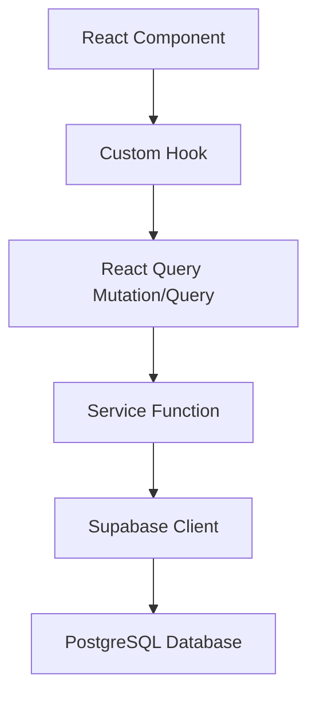
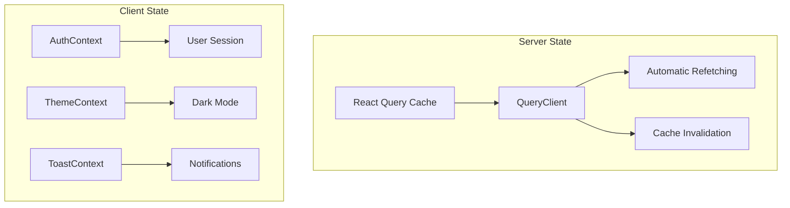
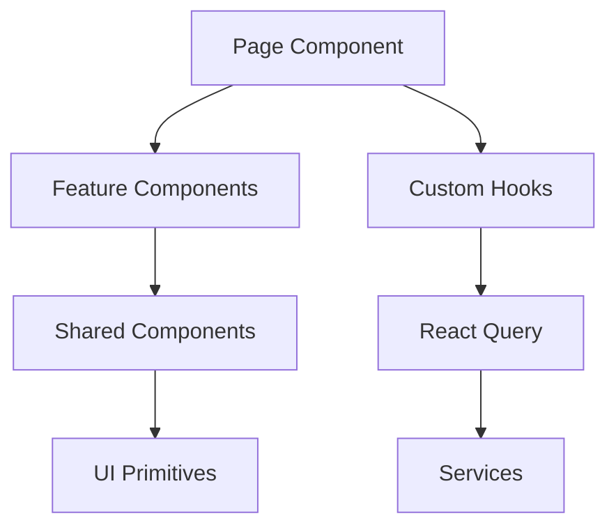
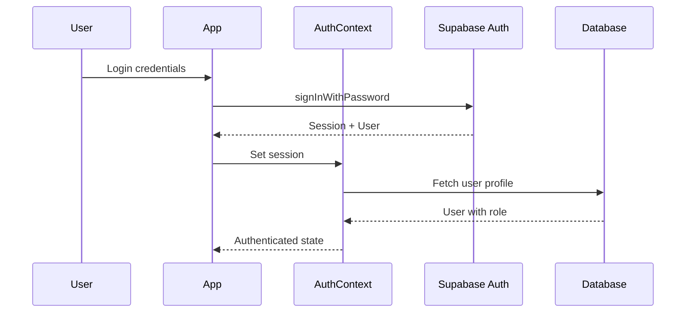
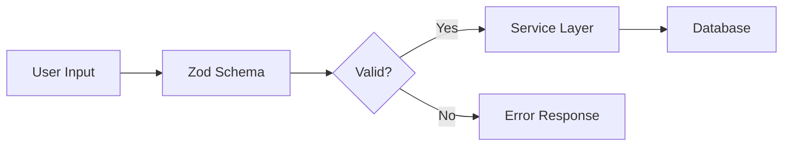
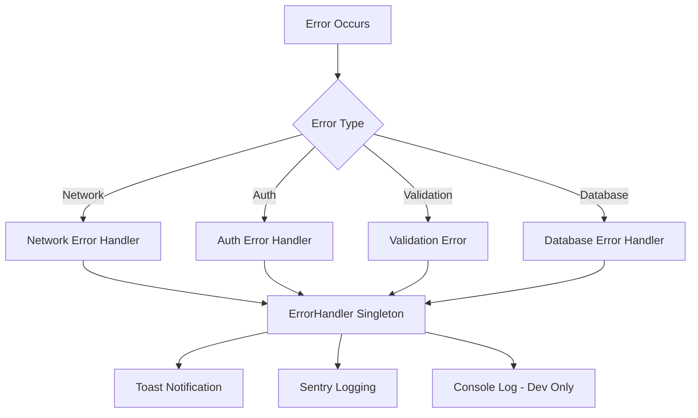
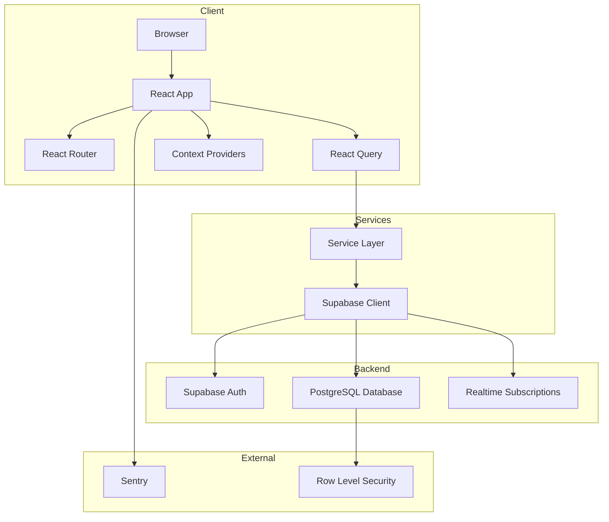

# WFM Application - Architecture Review

## Executive Summary

The WFM (Workforce Management) application is a modern, well-architected React-based single-page application for managing workforce operations including shift scheduling, leave requests, swap requests, overtime management, and break scheduling. The codebase demonstrates strong architectural decisions with clear separation of concerns, comprehensive type safety, and production-ready infrastructure.

---

## 1. Technology Stack

### Frontend Framework
| Technology | Version | Purpose |
|------------|---------|---------|
| React | 18.3.1 | UI library |
| TypeScript | 5.6.2 | Type safety |
| Vite | 6.0.5 | Build tool & dev server |
| React Router | 6.21.0 | Client-side routing |

### State Management & Data Fetching
| Technology | Purpose |
|------------|---------|
| TanStack React Query | Server state management, caching, and synchronization |
| React Context | Global UI state (auth, theme, toasts) |

### Backend & Database
| Technology | Purpose |
|------------|---------|
| Supabase | Backend-as-a-Service (Auth, Database, Realtime) |
| PostgreSQL | Primary database (via Supabase) |

### Styling
| Technology | Purpose |
|------------|---------|
| Tailwind CSS | Utility-first CSS framework |
| PostCSS | CSS processing |

### Testing
| Technology | Purpose |
|------------|---------|
| Vitest | Test runner |
| React Testing Library | Component testing |
| Testing Library User Event | User interaction simulation |
| fast-check | Property-based testing |

### Monitoring & Error Tracking
| Technology | Purpose |
|------------|---------|
| Sentry | Error tracking and performance monitoring |

### Code Quality
| Technology | Purpose |
|------------|---------|
| ESLint | Code linting |
| Prettier | Code formatting |
| Husky | Git hooks |
| lint-staged | Pre-commit checks |

---

## 2. Project Structure

```
wfm-app/
├── src/
│   ├── components/          # Reusable UI components
│   │   ├── BreakSchedule/   # Break schedule feature components
│   │   ├── Headcount/       # Employee management components
│   │   ├── OvertimeRequests/# Overtime request components
│   │   ├── Schedule/        # Schedule-related components
│   │   ├── Skills/          # Skills management components
│   │   ├── icons/           # SVG icon components
│   │   └── shared/          # Shared components (Layout, ErrorBoundary, etc.)
│   ├── constants/           # Application constants
│   ├── contexts/            # React Context providers
│   ├── hooks/               # Custom React hooks
│   ├── lib/                 # Utility libraries and configurations
│   ├── pages/               # Page components (route targets)
│   ├── services/            # API service layer
│   ├── test/                # Test files
│   ├── types/               # TypeScript type definitions
│   ├── utils/               # Utility functions
│   └── validation/          # Zod validation schemas
├── docs/                    # Documentation
├── public/                  # Static assets
└── .husky/                  # Git hooks
```

### Architecture Pattern: Feature-Sliced Design (Simplified)

The project follows a simplified feature-sliced architecture:

1. **App Layer** - [`App.tsx`](src/App.tsx) handles routing and provider composition
2. **Pages Layer** - Route-level components in [`src/pages/`](src/pages/)
3. **Features Layer** - Feature-specific components in subdirectories
4. **Shared Layer** - Reusable components, hooks, utilities

---

## 3. Core Architecture Patterns

### 3.1 Service Layer Pattern

All API interactions are abstracted through service modules:



**Key Services:**
- [`authService.ts`](src/services/authService.ts) - Authentication operations
- [`swapRequestsService.ts`](src/services/swapRequestsService.ts) - Swap request CRUD
- [`leaveRequestsService.ts`](src/services/leaveRequestsService.ts) - Leave request CRUD
- [`breakSchedulesService.ts`](src/services/breakSchedulesService.ts) - Break schedule management
- [`headcountService.ts`](src/services/headcountService.ts) - Employee management

### 3.2 State Management Architecture



**Server State (React Query):**
- Configured in [`queryClient.ts`](src/lib/queryClient.ts)
- Stale-while-revalidate caching strategy
- Automatic garbage collection
- Query key factory for consistent cache management

**Client State (React Context):**
- [`AuthContext`](src/contexts/AuthContext.tsx) - User authentication state
- [`ThemeContext`](src/contexts/ThemeContext.tsx) - Dark/light mode
- [`ToastContext`](src/contexts/ToastContext.tsx) - Toast notifications

### 3.3 Component Architecture



**Component Categories:**

1. **Page Components** - Route targets, compose features
2. **Feature Components** - Domain-specific UI (e.g., [`BreakScheduleTable`](src/components/BreakSchedule/BreakScheduleTable.tsx))
3. **Shared Components** - Reusable across features (e.g., [`Pagination`](src/components/shared/Pagination.tsx))
4. **Icon Components** - SVG icons as React components

---

## 4. Routing & Navigation

### Route Structure

Defined in [`App.tsx`](src/App.tsx:67-312):

| Route | Access | Purpose |
|-------|--------|---------|
| `/login` | Public | Authentication |
| `/signup` | Public | User registration |
| `/dashboard` | Protected | Main dashboard |
| `/schedule` | Protected | Shift schedule view |
| `/break-schedule` | Protected | Break schedule management |
| `/swap-requests` | Agent, TL | Swap request management |
| `/leave-requests` | Protected | Leave request management |
| `/overtime-requests` | Protected | Overtime request management |
| `/requests` | WFM only | Request approval queue |
| `/reports` | TL, WFM | Analytics and reports |
| `/headcount/employees` | TL, WFM | Employee directory |
| `/settings` | WFM only | System configuration |

### Route Protection

Two levels of route protection:

1. **[`ProtectedRoute`](src/components/shared/ProtectedRoute.tsx)** - Requires authentication, optional role check
2. **[`PublicRoute`](src/components/shared/PublicRoute.tsx)** - Redirects authenticated users

### Navigation Hook

[`useNavigation`](src/hooks/useNavigation.ts) provides:
- Role-based navigation filtering
- Active route detection
- Navigation item configuration

---

## 5. Authentication & Authorization

### Authentication Flow



### Role-Based Access Control (RBAC)

**User Roles:**
- `agent` - Basic employee access
- `tl` - Team Lead (manager access)
- `wfm` - Workforce Management (admin access)

**Permission Helpers in [`useAuth`](src/hooks/useAuth.ts:14-34):**
- `isWFM()`, `isTL()`, `isAgent()` - Role checks
- `hasRole(roles)` - Flexible role checking
- `canViewHeadcount()`, `canEditHeadcount()` - Feature permissions

---

## 6. Data Validation Strategy

### Zod Schema Validation

Validation is centralized in [`src/validation/`](src/validation/index.ts):



**Schema Categories:**
- Common schemas (UUID, email, date, time)
- Leave request schemas
- Swap request schemas
- User schemas
- Break schedule schemas

### Validation Flow

1. **Client-side** - Zod schemas validate form inputs
2. **Service layer** - Additional business validation
3. **Database** - PostgreSQL constraints and RLS policies

---

## 7. Error Handling Architecture

### Multi-Layer Error Handling



**Error Handler Features ([`errorHandler.ts`](src/lib/errorHandler.ts)):**
- Singleton pattern for centralized handling
- PII redaction for security
- Toast integration for user feedback
- Sentry integration for production tracking
- Local error log persistence

### Error Types

Custom error classes in [`types/errors.ts`](src/types/errors.ts):
- `ValidationError` - Input validation failures
- `ConcurrencyError` - Race condition handling
- `ResourceNotFoundError` - Missing resources
- `SwapExecutionError` - Swap operation failures

---

## 8. Performance Optimizations

### Code Splitting

Configured in [`vite.config.ts`](vite.config.ts:73-84):

```typescript
manualChunks: {
  'react-vendor': ['react', 'react-dom', 'react-router-dom'],
  'react-vendor-2': ['react/jsx-runtime'],
  supabase: ['@supabase/supabase-js'],
  'react-query': ['@tanstack/react-query', '@tanstack/react-query-devtools'],
  'date-utils': ['date-fns'],
}
```

### Lazy Loading

All pages except Login are lazy-loaded in [`App.tsx`](src/App.tsx:18-39):

```typescript
const Dashboard = lazy(() => import('./pages/Dashboard'));
const LeaveRequests = lazy(() => import('./pages/LeaveRequests/LeaveRequests'));
// ... etc
```

### React Query Optimization

- Stale-while-revalidate caching
- Configurable stale times per data type
- Automatic background refetching
- Query deduplication

### PWA Support

Configured via [`vite-plugin-pwa`](vite.config.ts:9-66):
- Service worker for offline support
- Runtime caching for Supabase requests
- Auto-update strategy

---

## 9. Design System

### Centralized Design Tokens

[`designSystem.ts`](src/lib/designSystem.ts) provides:

- **Color tokens** - Primary colors, semantic colors
- **Status colors** - Shift types, leave types, request statuses
- **Component styles** - Buttons, badges, cards, inputs
- **Helper functions** - `getStatusColor()`, `getShiftColor()`, `cn()`

### Tailwind Configuration

Custom theme in [`tailwind.config.ts`](tailwind.config.ts):
- Primary color palette (50-900)
- Dark mode via class strategy

---

## 10. Testing Architecture

### Test Categories

| Category | Location | Count | Purpose |
|----------|----------|-------|---------|
| Edge Cases | `src/test/edge-cases/` | 72 | Concurrency, boundaries, failures |
| Business Logic | `src/test/business-logic/` | 19 | Core workflows |
| Backend/RLS | `src/test/backend/` | 43 | Database policies |
| Integration | `src/test/integration/` | 33 | User flows |
| Unit Tests | Various | - | Components, hooks, utilities |

### Coverage Goals

- Overall: ≥70%
- Critical paths: ≥90%
- New features: ≥80%

---

## 11. Security Considerations

### Authentication Security
- Supabase Auth with secure session management
- Email domain validation
- Token auto-refresh

### Data Security
- Row Level Security (RLS) policies in database
- PII redaction in error logs
- Input sanitization with DOMPurify

### API Security
- Supabase anon key (safe for client-side)
- Service role key only in tests
- 30-second request timeout

---

## 12. Strengths

1. **Clean Architecture** - Clear separation between UI, business logic, and data access
2. **Type Safety** - Comprehensive TypeScript coverage with strict mode
3. **Modern Stack** - React 18, Vite, React Query, Tailwind CSS
4. **Performance** - Code splitting, lazy loading, caching strategies
5. **Testing** - Comprehensive test suite with multiple categories
6. **Error Handling** - Multi-layer error handling with Sentry integration
7. **Documentation** - Well-documented codebase with onboarding guides
8. **Developer Experience** - Hot reload, dev tools, linting, formatting
9. **Accessibility** - WCAG 2.1 AA compliance focus
10. **PWA Support** - Offline capability with service workers

---

## 13. Areas for Improvement

### 13.1 State Management
- **Consider Zustand** for complex client state (if it grows)
- **Evaluate React Query's optimistic updates** for better UX

### 13.2 Component Library
- **Extract UI primitives** to a separate component library
- **Consider headless UI libraries** (Radix, Headless UI) for accessibility

### 13.3 API Layer
- **Add request/response interceptors** for consistent error handling
- **Consider tRPC** for end-to-end type safety (if backend grows)

### 13.4 Testing
- **Add E2E tests** with Playwright or Cypress
- **Increase unit test coverage** for hooks

### 13.5 Performance
- **Add performance monitoring** (Sentry Performance)
- **Implement route-based chunk prefetching**

### 13.6 Architecture
- **Consider Domain-Driven Design** as the application grows
- **Evaluate micro-frontend architecture** if team scales

---

## 14. Recommendations

### Short-term (1-2 sprints)
1. Add E2E testing framework
2. Implement performance monitoring
3. Increase hook test coverage

### Medium-term (1-2 months)
1. Extract shared UI components to a package
2. Add route-based data prefetching
3. Implement optimistic updates for mutations

### Long-term (3+ months)
1. Evaluate micro-frontend architecture for team scaling
2. Consider server-side rendering (SSR) for SEO/performance
3. Implement feature flags system

---

## 15. Architecture Diagram



---

## 16. Conclusion

The WFM application demonstrates a well-architected frontend codebase with modern best practices. The separation of concerns, type safety, and comprehensive testing make it maintainable and scalable. The use of React Query for server state management and the service layer pattern provides a clean data flow architecture.

The main areas for growth are around E2E testing, performance monitoring, and potentially extracting shared components into a separate package as the application scales.

---

*Review conducted: 2026-02-21*
*Reviewer: Architecture Analysis*
